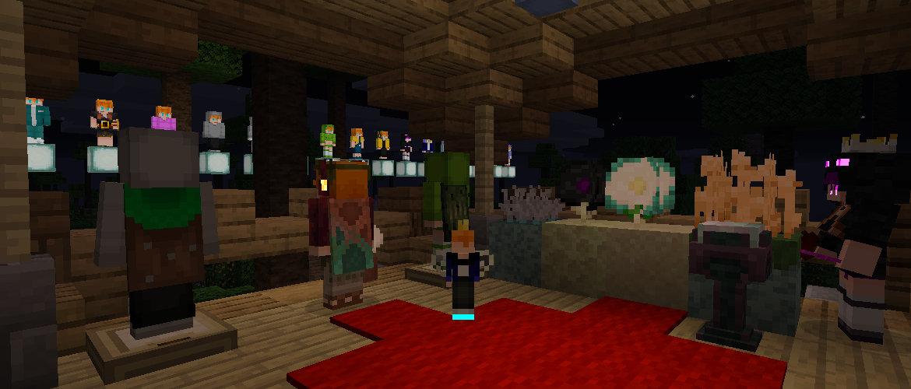

<h1 style="text-align: center;">- Back Math - 9.0.9 -</h1>

> **Written On:** 06-02-26 - **Last Updated:** 25-04-26

**9.0.9** is the ninth version for *Back Math* 9.0, released on January 9, 2026.[^1] It adds three new capes for termians, and exposes many of this mod's debugging utilities as JVM arguments.

## Additions
### Entities
- Added the "Common", "Copper" and "Zombie Horse" capes to the cape pool of termians.

## Changes
### Blocks
- **(*Revaried*)** The stained glass (pane) color tooltip now has a colored square instead of coloring the text.

### Items
- Updated the "Hold \<Key> for \<something>" tooltips to match *Reutilities*:
  - "Hold [Left Shift] for Description" for item descriptions;
  - "Hold [Left Shift] for Attributes" for bow attributes;
  - "*(Hold [Left Shift] to see all items)*" for when there are too many items in a crate.
- **[Bra. Portuguese]** Fixed a typo in the devil and angelic crown names: "Corora" to "Coroa".
- **[Bra. Portuguese]** The key binding category is now translated: "Melony Studios" to "Estúdios Melony".

### Entities
- Queen lucy pets from before 1.9.0.8 no longer have pure black ponchos.
  - Queen lucy pets affected by this bug won't have their poncho color set to light blue.

## Technical
### Additions
- Added a README file to the project (finally!).
- *Back Math* now has a flair accent color: **#AA2A2A**, used for *Mellow UI*'s mod list.
- Added a built-in panorama under `backmath:default_panorama` to be used with *Mellow UI*.
- Added descriptions to all 1.9.X versions in the update checker file.
- Added "1.8.0-beta" to the update checker file.

#### [`BMDebuggingFlags`](/Melony%20Studios%20Wiki/Debugging%20Flags.md)
This is a new class in some of my mods that controls the behavior of dev-only features, replacing the old `melony-studios-dev` version check. This mod includes the following flags:
- `-Dbmdebug.revariedItemTagDisplay` (bool): Displays an item's NBT/tag on its tooltip. This was copied over from *Revaried*;
- `-Dbmdebug.apsPlacementCommand` (bool): Adds the `/backmath-aps_placement` debug command, for testing the placement of Aljan portal stands;
- `-Dbmdebug.spawnWandererTermiansCommand` (bool): Adds the `/backmath-spawn_wanderer_sophies` command, which spawns all wanderer termian variants in a row;
- `-Dbmdebug.spawnQueenLuciesCommand` (bool): Adds the `/backmath-spawn_queen_lucies` command, which spawns all queen lucy variants in a row;
- `-Dbmdebug.spawnQLPsCommand` (bool): Adds the `/backmath-spawn_qlps` command, which spawns all queen lucy pet variants in a row;
- `-Dbmdebug.worldTimesCommand` (bool): Adds the `/backmath-world_times` command, which prints the current world/game time in different formats;
- `-Dbmdebug.boobRendering` (bool): Allows breast rendering on termians and alcalytes even if *Female Gender Mod* isn't loaded;
- `-Dbmdebug.termianTittySize` (float): Controls the breast size of wanderer termians and queen lucies when spawned using the debug commands.

These flags are JVM properties that can be used when launching an instance.

### Changes
- Data-driven registry entries no longer persist across world loads.
  - All reload listeners have been updated to match *Mellow UI*'s implementation of them.
- Changed the mod version to `9.0.9`, removing the extra `1.` at the beginning and the `-beta` at the end.
  - This also makes the update checker find updates properly.
- Updated the Mixin library to `0.8.5`.
- Updated Gradle to `7.6`, from `6.8.3`.
- Updated ForgeGradle to `5.1.+`, from `4.1.+`.
- Updated JEI to `7.8.0.1013`.
- Added and updated the Javadoc in various classes.
- Renamed the mob variant *Forge* registries to match their new name from [1.9.0.7](Changelog%201.9.0.7-beta.md).
- Changed the phrase "configuration file" to "settings file" in the settings file header to match the rename to *BMSettings*.
- Data generator names now use an em dash (—) instead of a hyphen (-).
  - Added a name for the crystallizer recipes provider ("Back Math — Crystallizer Recipes").
  - Added a "V1" text to the original block states and models provider.
  - Renamed the wanderer termian variant provider to "Back Math — Wanderer Termian Variants", from "Back Math - Wanderer Sophie Variants".
- Updated the jar file name format to match my other mods: `backmath-forge-<version>+1.16.5[-<pre>].jar`.
- Renamed the following classes and methods:

| Old Name                                                 | New Name                                                 |
| -------------------------------------------------------- | -------------------------------------------------------- |
| BMUtils`.ALJAN_TEXTURE_UPDATE_ID`                        | AljanTextureUpdatePack`.ALJAN_TEXTURE_UPDATE_ID`         |
| BMBlockTags`.ALJAN_CROP_PLANTABLE_ON`                    | BMBlockTags`.ALJAN_CROP_MAY_PLACE_ON`                    |
| BMBlockTags`.ENDER_DRAGON_FRIED_EGG_FLOWER_PLANTABLE_ON` | BMBlockTags`.ENDER_DRAGON_FRIED_EGG_FLOWER_MAY_PLACE_ON` |
| BMBlockTags`.TURTLE_FRIED_EGG_FLOWER_PLANTABLE_ON`       | BMBlockTags`.TURTLE_FRIED_EGG_FLOWER_MAY_PLACE_ON`       |
| BMBlockTags`.WILD_CROPS_PLANTABLE_ON`                    | BMBlockTags`.WILD_CROPS_MAY_PLACE_ON`                    |
| BMConfigs`.COMMON_CONFIG`                                | BMSettings`.SETTINGS`                                    |
| BMConfigs`.COMMON_SPEC`                                  | BMSettings`.SPEC`                                        |
| OutfitDefinition`.DATA_DRIVEN_OUTFITS`                   | OutfitDefinition`.OUTFIT_DEFINITIONS`                    |
| QueenLucyPetVariant`.DATA_DRIVEN_VARIANTS`               | QueenLucyPetVariant`.VARIANTS`                           |
| QueenLucyVariant`.DATA_DRIVEN_VARIANTS`                  | QueenLucyVariant`.VARIANTS`                              |
| WandererSophieVariant`.DATA_DRIVEN_VARIANTS`             | WandererSophieVariant`.VARIANTS`                         |
| ClientProxy`.addAljanTextureUpdatePack`                  | AljanTextureUpdatePack`.add`                             |
| BMUtils`.aljanPackEnabled`                               | AljanTextureUpdatePack`.isEnabled`                       |
| BackMath`.textureLocation`                               | BackMath`.toTexturePath`                                 |
| BMHeadType`.getEyesLocation`                             | BMHeadType`.emissiveLocation`                            |
| BMHeadType`.usesPlayerLikeTexture`                       | BMHeadType`.squareTexture`                               |
| BMHeadType`.getTextureLocation`                          | BMHeadType`.textureLocation`                             |
| BMUtils`.getTermianPatrollerCape`                        | BMUtils`.getCapeTexture`                                 |
| BMUtils`.getTermianBannerInstance`                       | BMUtils`.getTermianBannerStack`                          |
| BMUtils`.randomizeWandererSophieVariant`                 | BMUtils`.randomizeWandererTermianVariant`                |
| BMEventBusEvents                                         | BMEvents                                                 |
| BMEvents                                                 | BMForgeEvents                                            |
| BMCommonConfigs                                          | BMSettings                                               |
| OutfitProvider                                           | ComponentOutfit                                          |
| OutfitWearer                                             | FullBodyOutfit                                           |
| OutfitDefinitionManager                                  | OutfitDefinitionReloadListener                           |
| QueenLucyPetVariantManager                               | QueenLucyPetVariantReloadListener                        |
| QueenLucyVariantManager                                  | QueenLucyVariantReloadListener                           |
| WandererSophieVariantManager                             | WandererSophieVariantReloadListener                      |

### Removals
- Removed the following classes:
  - `BMConfigs`;
  - `BMDataGenerator` (merged contents with *BMEvents*).

## Tags
### Changes
- Renamed the following block tags:
  - `#backmath:aljan_crop_plantable_on` to `#backmath:may_place_on/aljan_crop`;
  - `#backmath:ender_dragon_fried_egg_flower_plantable_on` to `#backmath:may_place_on/ender_dragon_fried_egg_flower`;
  - `#backmath:turtle_fried_egg_flower_plantable_on` to `##backmath:may_place_on/turtle_fried_egg_flower`;
  - `#backmath:wild_crops_plantable_on` to `#backmath:may_place_on/wild_crops`.

### References
[^1]: ["9.0.9 (Part I): Debugging Flags & Updates from Other Mods"](https://github.com/isabellawoods/Back-Math/commit/83d975684e1b72be3cf57825f175a6b3811480ae) (Commit `83d9756`) – GitHub, January 9, 2026.