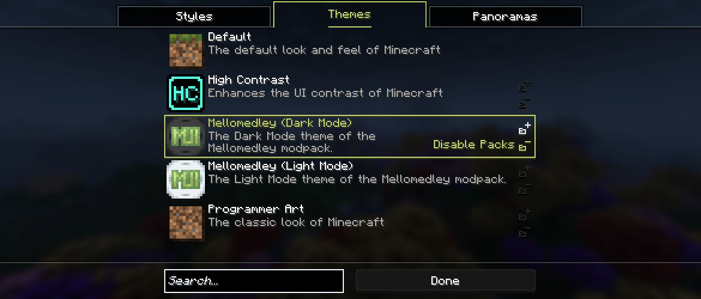

<h1 style="text-align: center;">- Mellow UI 5.0.0 Beta 3 -</h1>

> **Written On:** 16-12-25 - **Last Updated:** 03-01-26

**5.0.0 Beta 3** is a major release for *Mellow UI*, released on December 21, 2025 on 1.16.[^1][^2][^3] It adds themes, makes post-processing effects loaded via resource packs, and makes various changes to other screens.

## Additions
### Options
- Added **1** new client config:
  - `selectedTheme`: Stores the currently selected theme.
- Added **1** new widget config:
  - **Widgets** category:
    - `lockedWidgetTextColor`: Color of locked widgets or list entries, such as panoramas or post-processing effects.

### Miscellaneous
- Added **themes** to resource packs.
  > *Documentation: [**Themes**](/Mellow%20UI/Docs/Theme.md)*
  - Themes allow you to define panoramas, change any currently-loaded GUI texture, add/remove resource packs, and override flairs.
  - Resource packs need to be enabled/disabled using the buttons on the themes list.
  - Themes also include a `configs` field to override *Forge* configs, but that hasn't been implemented yet. Defining it will log a warn about it being unfinished.
  - Panoramas are properly overridden if the theme provides one. If the game is reloaded, it won't remember which one was selected before, and won't switch back.
  - Currently, the mod includes **3** themes:
    - **Default**: the default theme. Does not make any changes;
    - **Programmer Art**: extension of the Programmer Art resource pack. It changes most UI textures to match the old style, and gives the option to apply the pack if wanted;
    - **High Contrast**: extension of the High Contrast resource pack. It only changes the default flair color to **#FFFF55**, and gives the option to apply the pack if wanted.
- Post-processing effects are loaded from resource packs.
  - By default, this change adds the "Transparency" shader to the Super Secret Settings list, but any mods that add new shaders (like *Quark*) are also included now.
  - As there's no way I know to find the correct uniforms, they are currently hardcoded for only the vanilla shaders.
- Added a unique flair color for *Minecraft*: **#6CC349** (light green).
- Added a dark mode version of *Mellomedley*'s title screen gradient.

## Changes
### Miscellaneous
- **(1.16)** The update available icon is now rendered slightly further into the button when in the corner.
- **(1.16)** Scrollers in lists and panels now change the cursor to the "pointing hand" shape when hovered but not pressed.
- **(1.16)** When fading panoramas, if both of them are the same, the panorama no longer spins a bit faster during the "fading" period.
- Hovering over disabled icon buttons no longer displays their text.
- Icon buttons no longer render the shadow by themselves, it now has to be baked into the texture.
- Updated the appearance of the list selection on some lists:
  - Panoramas;
  - Themes;
  - Post-processing effects;
  - *Mellow UI*'s pack list;
  - Loading warnings/errors;
  - General/item/mob statistics;
  - This new selection consists of the same border, but with a shadow and the color originating from its the widget color options. It has no background color.
- Selecting a list entry with the same hash code as previous one no longer plays the "list entry select" sound.

### Textures
- Updated *Mellomedley*'s background gradient texture.
- Added an inner black border to the panorama frame textures.
- Added a shadow to all icon button textures.

### Translations
- **(1.16)** Song translations in Brazilian Portuguese now use an em dash (—) instead of a hyphen (-).
- **(1.16)** Changed the "WHAT!" in the "cannot find *Forge*" error message to "... how?".
  - Changed from "QUE!" to "... como?" in Brazilian Portuguese.
- **(1.16)** Removed all translations strings related to the `CustomizedWorldOptionsScreen`.
- **(1.16)** Updated the tooltip of the **Screen Background** style option to include **Fading Blur**.
- **(1.16)** The "Autor(es)" text in *Mellow UI*'s mod list has been changed to "Autor(es):" in Brazilian Portuguese.
- Changed the breast settings error message to say "options" instead of "skin customization".
- Added the word "mod" before the mod id in the "broken config screen" error message.
- Updated the slabfish hat and breast settings error messages in Brazilian Portuguese.
  - "Slabfish Hat Settings" is now translated.
  - Replaced "no menu" with "ao menu".

### Options
- Removed a trailing ")" on the description of `listBackgroundStyle`.
- Inverted the **Disable Branding** option into **Branding Lines**, with its effect and translations being changed accordingly.
- Updated the `selectedPanorama` description to say that panoramas can be overridden by themes.
- Renamed `modNameTextPadding` to `modEntryTextPadding`, as it now affects the mod version text.
  - The mod version text effectively has more padding than defined for visual purposes.
  - Updated all translations accordingly.
- The **String Widget Text Padding** option is now clamped when used.
- The **UI** volume slider now plays its preview sound.
- Updated the *Mellomedley* version to `0.7`.

### Screens
- Per-screen panoramas are now controlled by the panorama definition itself.
- Resizing the game's window on a screen with tabs no longer selects the first tab.
- The panorama's blur strength is no longer used in-game, causing excessive blurring.

#### Customization
- Options on the "Styles" tab are now split into four categories: Backgrounds, Screens, Options and Forge.
- The "Themes" tab is now functional.
  - Themes display their icon on the right side, or a missing icon if none is present.
    - This missing icon is colored based on the widget text options.
  - Their name and description are shown in three lines, an go all the way to the edge of the entry.
  - If the theme provides resource packs, two icon buttons are added on the left: "Enable Packs" and "Disable Packs". These can only be used if the theme is selected.
    - The theme description is shrunk to not conflict with the button text.
  - Entries are sorted alphabetically by their name translations.
  - Has the same search text as the panorama list.
  - The search box now applies to this list too.
- Updated various aspects of the "Panoramas" tab:
  - Are now locked if the selected theme overrides it.
    - A red overlay with a "Locked" text appears over the icon, together with a red lock.
    - The name is shown in red, and panoramas cannot be selected.
  - The speed and pitch overrides of a panorama are now displayed on top of the icon.
    - This renders at the bottom-right corner with half-transparency.
    - The pitch shows as "%sº" (constant) or "ᛨ%s" (bobbing), and speed overrides as "%sx".
  - Descriptions no longer overflow into other entries.
  - The panorama id is no longer shown if **Advanced Tooltips** is disabled.
  - Entries are now sorted by their name translations.

#### *Mellow UI*'s Mod List
- **(1.16)** Going to another screen and coming back now centers the list on the previously selected mod.
- **(1.16)** The search text no longer persists after closing the screen.
- Going to another screen and coming back now selects the entry of the previously selected mod.
- The mod entry version text can now scroll if needed.
  - The padding is the **Mod Entry Text Padding** option plus 1.
- Mod entries outside the list bounds no longer change the cursor shape.
- Holding the panel scroller, and moving the cursor outside of the panel's bounds before the scroller does, now puts it at the bottom/top of the panel.
- The version on mod changelogs is now colored based on the mod's accent color.

#### Statistics
- Item tooltips are now shown only if the cursor is within the bounds of the list.

#### Super Secret Settings
- Added a search box to this screen. It behaves like other search boxes, but it doesn't support searching by namespaces.
  - Moved the title up to accommodate.
- The list is now sorted alphabetically from the post effect translations.
  - Untranslated effects are put at the end of the list.
  - Now "Default (Blur)" is no longer the first entry.
- Tooltips are now rendered by the list entries (using `TooltipProvider`). This means it'll only render if the entry does.
- The "(ID X)" tooltip line has been removed.
- If shaders cannot be selected, entries now use the **Locked Widget Text** color.
  - The "WARNING" on the "cannot select shaders" tooltip line has been removed.
- Sounds now originate from the client, instead of the sound registry.
  - Any sound added by a resource pack can now be played.
- The played sound log is now translatable, and controlled by a debugging flag.

#### Title
- Moved the toolbar buttons one pixel to the right.
- **(1.16)** *Mellomedley*'s title screen title now obeys the **Title Text** color option, despite not being visible.
- Moved the *Mellomedley* splash text position down by 5px.
- Changed the size of the *Mellomedley* logo, so it's no longer stretched.

## Technical
### Additions
- Added the  **used_in** field to panorama definitions.
  - This field provides a list of `Screen` class paths that the panorama renders in. See [panorama](Panorama.md) for the full description.
- The  **accent_color** field in flair definitions now accepts hexadecimal values (prefixed with "#").
  - All flairs added by this mod have been changed to use hexadecimal.
- Reenabled the update checker for this mod.

#### `DebuggingFlags`
This is a new class in some of my mods that controls the behavior of dev-only features. This mod includes the following flags:
- `DEBUG_OOPS_ALL_TEXTURES`: Allows themes to override ***any*** texture being loaded, including dynamic textures. *Use at your own risk*;
- `DEBUG_CONSTANT_MUSIC_TOAST`: displays the music toast from the start to finish of the song. Used for easing the changelog photoshoot process;
- `DEBUG_FAKE_LOADING_ERRORS`: Fakes a mod loading error to test the UI change rollback;
- `DEBUG_LOG_SECRET_SETTINGS_SOUNDS`: Logs the sound played in the Super Secret Settings screen;
- `DEBUG_RECTANGLE_RAVE`: draws a colored box around every scissor rectangle. Has this name due to a bug during development.

### Changes
- *Mellow UI* now uses logger markers instead of appending the logger name on creation.
- Renamed the `title_screen_icons_background` texture to `title_screen_icons`.
- Renamed the `main_menu_gradient` texture from *Mellomedley* to `title_screen_gradient_light`.
- Clearing the current shader no longer saves the `selectedEffect` option if it's already the default.
- **(1.16)** The non-translated version of the flair logger messages now use "flair" instead of "mod list flair".
- Panoramas with more or less than 6 `cube_map` textures now fail to parse.
- Panoramas with a negative `blur_strength` now fail to parse.
- Auto-generated panoramas are now blocked if any loaded panorama has the same hash code as its textures.

#### Classes and Methods
- Renamed the following classes, methods and fields:

| Old Name                                      | New Name                                      |
| --------------------------------------------- | --------------------------------------------- |
| GUISpriteUploader`.registerGUISpriteUploader` | GUITextureManager`.registerGUITextureManager` |
| Panoramas`.panoramaLocation`                  | Panoramas`.assetID`                           |
| MellowUtils`.PANORAMAS`                       | Panoramas`.PANORAMAS`                         |
| MellowUtils`.OVERRIDERS`                      | Panoramas`.OVERRIDERS`                        |
| MellowUtils`.FLAIRS`                          | Flairs`.FLAIRS`                               |
| MellowUtils`.randomBetween`                   | SuperSecretSettingsScreen.`randomBetween`     |

- `VanillaRenderComponents` no longer has a `font` field. This was causing crashes in both versions, especially with *Create*.
- `VanillaRenderComponent.setColor(int, float)` now works properly.
- Moved `ShaderManager` to the `util` package, and `PostEffect` into `resource.posteffect`.
- Updated `PostEffect`:
  - "uniforms" is no longer optional/nullable. For no uniforms, use an empty array instead;
- `ScreenPosition` and `ScreenRectangle` now have proper hash code implementations.

### Removals
- Removed `PostEffects`, as they're now loaded via resource packs.
- Removed the id field from post effect definitions.

### References
[^1]: **(1.16)** ["5.0.0 (B-III P-I): Panorama Transition Fixes"](https://github.com/isabellawoods/Mellow-UI/commit/24eed3627dd55711b51d5372c7fd2c4bdcc3a5d8) (Commit `24eed36`) – GitHub, December 13, 2025.
[^2]: **(1.16)** ["5.0.0 (B-III P-II): Hex Flairs & Translation Fixes"](https://github.com/isabellawoods/Mellow-UI/commit/0600e38f0c8b746fdb58904d7a250a3d05e634f4) (Commit `0600e38`) – GitHub, December 16, 2025.
[^3]: **(1.16)** ["5.0.0 (B-III P-III): Themes & RP Post Effects"](https://github.com/isabellawoods/Mellow-UI/commit/01b0f430a5f92c7497c0ba873de6902e1e4f6f43) (Commit `01b0f43`) – GitHub, December 21, 2025.