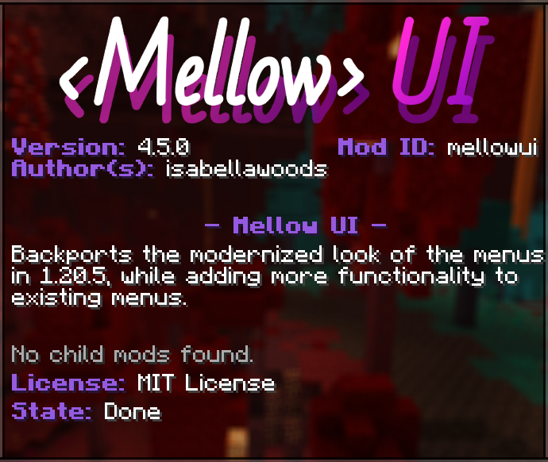

# Flair
> **Last Updated**: 4-11-25 (4.5.0)

A **flair** is per-mod customization options for their own entry on *Mellow UI*'s mod list and configuration screens. Flairs can be defined using JSON files in a resource pack at the path `assets/<namespace>/flair/<mod_id>.json`.

Currently, they can only change the accent color of the mod's entry on the mod list.

  

*How the flair looks on the Mellow UI's mod list.*

## JSON format
Flairs are defined using the following format:

-  The root object.
  -  **accent_color**: An integer defining the color used to accentuate the mod's entry on the mod list. Uncapped, but recomended to stay within **0** and **16777215**.

## Flair selection
If a flair is not defined for a mod, the `mellowui:default` flair is used instead, and if the *"High Contrast"* resource pack is enabled, it overrides the default to have its own color.

### Existing flairs
- *Mellow UI*: <c style="color:#955AE0">⏹</c> **#955AE0**;
- *Forge*: <c style="color:#DFA76A">⏹</c> **#DFA76A**;
- Default: <c style="color:#FFFFA0">⏹</c> **#FFFFA0** (<c style="color:#FFFF55">⏹</c> **#FFFF55** if using *High Contrast*);

## History
| Version | Changes |
|---------|---------|
| [4.5.0](/Mellow%20UI/Changelogs/Changelog%204.5.0.md) | <li> Added flairs to resource packs. </li> <li> The location of the default flair is `mellowui:default`. </li> |
| [4.6.0](/Mellow%20UI/Changelogs/Changelog%204.6.0.md) | Changed the location of the default flair to `mellowui:builtin/default`, to not have any possible conflicts with mods. |

## Issues
Issues relating to "flair" are maintained on [*Mellow UI*'s bug tracker](https://github.com/isabellawoods/Mellow-UI/issues). Issues should reported and viewed there.

## Navigation
### Resource pack definitions
|               |                                                                                                                         |
| ------------- | ----------------------------------------------------------------------------------------------------------------------- |
| **Mellow UI** | **Flair** ▪ [Panorama](/Mellow%20UI/Docs/Panorama.md) |