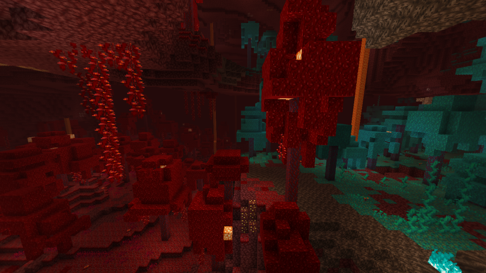

# Panorama
> [!NOTE]
> **Last Updated**: 4-11-25 (4.6.0)

A **panorama** is a set of textures  and properties that are rendered on the background of nearly all screens. Panoramas can be defined using JSON files in a resource pack at the path `assets/<namespace>/panorama`.

  

*A still shot of the [Nether Update](https://minecraft.wiki/w/Nether_Update) panorama*

## JSON Format
Panoramas are defined using the following format:

-  The root object.
  -  **cube_map**: A list of **exactly six** textures for each side of the cube, omitting the `textures/` prefix and `.png` suffix.
  -  **overlay**: *(optional)* The texture of the panorama overlay.
  -  **speed_override**: *(optional)* A float that overrides the speed the panorama spins at.
  -  **pitch_override**: *(optional)* A **pitch overrider** that defines the pitch of the panoramic camera.
    -  **type**: The id of the pitch overrider to use:
      - `mellowui:constant`;
      - `mellowui:bobbing`.
    - Other fields depending on the  **type**, see below.
  -  **shader**: *(optional)* The resource location of a post effect to render on the panorama. The available effects can be seen [here](#Post%20effects). **These are currently hardcoded**.
  -  **blur_strength**: *(optional)* An integer that overrides the "*Menu Background Blur*" option, controlling how blurry the background should be.

### `constant`
-  **pitch_override**: The root object.
  -  **type**: `mellowui:constant`.
  -  **pitch**: The pitch used on the panoramic camera. Clamped from `-90` to `90`, and defaults to `10`.

### `bobbing`
-  **pitch_override**: The root object.
  -  **type**: `mellowui:bobbing`.
  -  **bobbing_strength**: How strong the bobbing effect should be. Clamped from `0` to `10`, and defaults to `0.001`.

## Post effects
*Minecraft* and *Mellow UI* together include **27** built-in post effects that can be rendered on the panorama. These are:
- `mellowui:blur`: The default blur shader used on the panorama. This one doesn't render on the title screen;
- `minecraft:antialias`;
- `minecraft:art`;
- `minecraft:bits`;
- `minecraft:blobs`;
- `minecraft:blobs2`;
- `minecraft:blur`: Slightly different from the default blur shader, and also applies to the title screen;
- `minecraft:bumpy`;
- `minecraft:color_convolve`;
- `minecraft:creeper`;
- `minecraft:deconverge`;
- `minecraft:desaturate`;
- `minecraft:entity_outline`;
- `minecraft:flip`;
- `minecraft:fxaa`;
- `minecraft:green`;
- `minecraft:invert`;
- `mellowui:love`: The "love" shader from the [Love and Hugs](https://minecraft.wiki/w/Java_Edition_15w14a) update;
- `minecraft:notch`;
- `minecraft:ntsc`;
- `minecraft:outline`;
- `minecraft:pencil`;
- `minecraft:phosphor`;
- `minecraft:scan_pincushion`;
- `minecraft:sobel`;
- `minecraft:spider`;
- `minecraft:wobble`.

## History
| Version | Changes |
|---------|---------|
| [4.5.0](/Mellow%20UI/Changelogs/Changelog%204.5.0.md) | Added panoramas to resource packs. |
| [4.6.0](/Mellow%20UI/Changelogs/Changelog%204.6.0.md) | Added the  **blur_strength** field. |

## Issues
Issues relating to "panorama" are maintained on [*Mellow UI*'s bug tracker](https://github.com/isabellawoods/Mellow-UI/issues). Issues should reported and viewed there.

## Navigation
### Resource pack definitions
| | |
|-|-|
| **Mellow UI** | [Flair](/Mellow%20UI/Docs/Flair.md) ▪ **Panorama** |