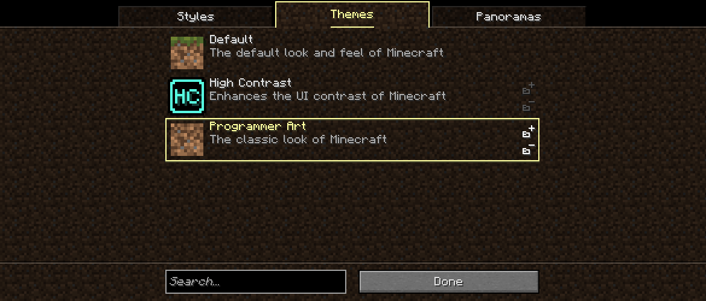

# Theme
> [!NOTE]
> **Last Updated**: 03-01-26 (5.0.0-beta3)

A **theme** overrides various aspects of *Mellow UI*, such as panoramas, flairs and textures. Themes can be defined using JSON files in a resource pack at the path `assets/<namespace>/theme/`.

<div style="text-align: center;">



*The "Programmer Art" theme with its resource pack applied.*
</div>

## JSON format
Themes are defined using the following format:
-  The root object.
  -  **panorama**: *(optional)* A resource location pointing to a [panorama](/Mellow%20UI/Docs/Panorama.md). If defined, you can't switch panoramas while this theme is selected.
    - **Examples**: `mellowui:beta`, `melonystudios:mellomedley/dark`.
  -  **flairs**: *(optional)* A map of flair ids to accent colors, which overrides the existing flairs provided by other resource packs.
    -  ***Flair id***: An integer (either decimal or hexadecimal) overriding the accent color of the flair used as the key.
    - **Example**: `"mellowui:builtin/default": "#ffff55"`.
  -  **configs**: *(optional)* Overrides entries of *Forge* configs. ***TO BE ADDED, below is how this field should work***:
    -  ***Config file resource location***: path of the config file relative to the `configs` folder, plus the mod's namespace.
      - ***Config entry path***: New config value, overrides the one currently loaded in the config.
    - **Example**:
```json
"mellowui:melonystudios/mellowui-client.toml": {
  "styleOptions.logo": "OPTION_4",
  "vanillaOptions.uiVolume": 0.5
}
```
  -  **resource_packs**: *(optional)* A list of resource pack ids this theme provides. Packs can be applied with the "Enable/Disable Pack" buttons on the theme list.
    -  A resource pack id. IDs for packs can be found in the `options.txt` file under `resourcePacks`.
    - **Examples**: `programer_art` (yes, it's misspelled), `mellowui:high_contrast`, `file/Default Panorama.zip`.
  -  **textures**: *(optional)* A map of resource locations to resource locations, overriding the texture in the key with the one from the value.
    -  ***Texture path***: A resource location of a GUI texture to load instead of the key's texture. The `textures/` prefix and `.png` suffix may be omitted.
    - The texture path **must** be the full path to the texture, including the `textures/` and `.png`.
    - **Example**: `"minecraft:textures/gui/options_background.png": "minecraft:block/bedrock"`: replaces the default background texture with bedrock.

## History
| Version                                                           | Changes                         |
| ----------------------------------------------------------------- | ------------------------------- |
| [5.0.0-beta3](/Mellow%20UI/Changelogs/Changelog%205.0.0-beta3.md) | Added themes to resource packs. |

## Issues
Issues relating to "theme" are maintained on [_Mellow UI_'s bug tracker](https://github.com/isabellawoods/Mellow-UI/issues). Issues should reported and viewed there.

## Navigation
### Resource pack definitions
|               |                                                                                                                                                                                                |
| ------------- | ---------------------------------------------------------------------------------------------------------------------------------------------------------------------------------------------- |
| **Mellow UI** |  [Flair](/Mellow%20UI/Docs/Flair.md) ▪  [Panorama](/Mellow%20UI/Docs/Panorama.md) ▪  **Theme** |
