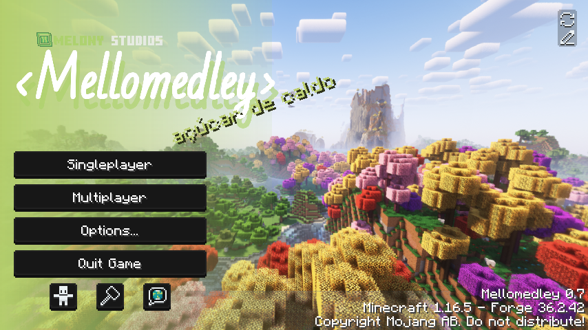

# Mellomedley
**Mellomedley** is a modpack released by *Melony Studios*, which is a collection of most mods released by me, with other mods on top to make a better playing experience.

On total, it has **62**\* mods, **7**\* of which are my own.*[please check actual mod counts]*

| | |
|-|-|
| **Developer(s)** | [isabellawoods](https://github.com/isabellawoods); |
| **Edition** | [*Java Edition*](https://minecraft.wiki/w/Java_Edition) |
| **Release date** | N/A |
| **Modpack version** | 0.4 |
| **Game version** | [1.16.5](https://minecraft.wiki/w/Java_Edition_1.16.5) |
| **Forge version** | 36.2.39 |
| **Total mods** | 62 |