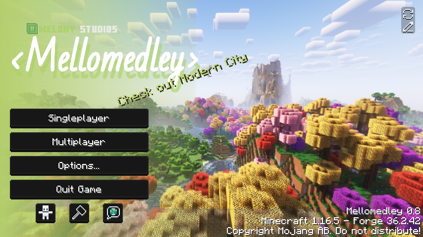

# Mellomedley
**Mellomedley** is a modpack made by *Melony Studios*, which is a collection of most mods released by me, with other mods on top to make a better playing experience.

On total, it has **65** mods, **15** of which are my own, and **1** was backported from 1.18: *Female Gender Mod*.

|                     |                                                        |
| ------------------- | ------------------------------------------------------ |
| **Developer(s)**    | [isabellawoods](https://github.com/isabellawoods)      |
| **Edition**         | *Java Edition*                                         |
| **Release date**    | TBA                                                    |
| **Modpack version** | `0.8`                                                  |
| **Game version**    | [1.16.5](https://minecraft.wiki/w/Java_Edition_1.16.5) |
| **Forge version**   | 36.2.42                                                |
| **Total mods**      | 65[^1]                                                 |

## Mod list
### Melony Studios' mods
- Back Math (**9.0.9**)
- Creeper Edits (**1.3.1**)
- Edits (**1.4.3.8**)
- F10 Elements (**1.4.4**)
- Fabricated F10 (**1.1**)
- Female Gender Mod (**2.9.1**, ported from 1.18)
- In Real Life - Sophie Clothes (**1.2**)
- Mellotech (**1.0.0**)
- Mellow UI (**5.0.0-beta4**)
- Mob Taker (**1.4.2**)
- Project Alcook (**1.4.2**)
- Rimcraft (**1.1.2**)
- Sam's Workshop (**1.1.0**)
- Stancements (**0.2.0**)
- The Mato (**3.6.0**)
- Revaried (**8.0.11**)

### Other mods
- Antique Atlas (was previously *Map Atlases*)
- Apple Skin
- Architectury API
- Bookshelf
- Botany Pots
- Caelus API
- Charm of Undying
- Chat Heads
- Cloth Config API
- \[**CurseForge**] Configured
- \[**CurseForge**] Controlling
- Curios API
- Embeddium
- Elytra Slot
- Entity Culling
- Ferrite Core
- \[**CurseForge**] FTB Backups 2
- \[**CurseForge**] FTB Library
- \[**CurseForge**] FTB Quests
- \[**CurseForge**] FTB Teams
- Iceberg
- \[**CurseForge**] Item Filters
- Jade
- Just Enough Effect Descriptions
- Just Enough Items
- \[**CurseForge**] Just Enough Resources
- Konkrete
- \[**CurseForge**] Lazy DFU
- Lootr
- Memory Leak Fix
- Modern Fix
- Mouse Tweaks
- NBT Autocomplete
- Not Enough Animations
- Oculus
- Open Loader
- Patchouli
- Polymorph
- Prism
- \[**CurseForge**] Rhino
- \[**CurseForge**] Searchables
- Shulker Box Slot
- \[**CurseForge**] Shut Up Experimental Settings!
- Smarter Villagers
- Spark
- \[**CurseForge**] Target Dummy (Dummmmmmy)
- TexTrue's Embeddium Options
- Vein Mining

## Shaders
- Complementary Reimagined

## Resource packs
- [The Mato Music Pack](/Melony%20Studios%20Wiki/Resource%20Packs/Music%20Packs/The%20Mato%20Music%20Pack.md)
- [Back Math Music Pack](/Melony%20Studios%20Wiki/Resource%20Packs/Music%20Packs/Back%20Math%20Music%20Pack.md)
- [Mellow UI (Dark)](/Melony%20Studios%20Wiki/Resource%20Packs/UI%20Packs/Mellow%20UI%20(Dark).md)
- Mellow UI (Light)
- \[**Built-in**] Mellomedley Resources

## Data packs
- \[**Built-in**] Mellomedley Resources

### Notes
[^1]: 65 total jar files. Shows up as 70 in-game due to "stub mods" 