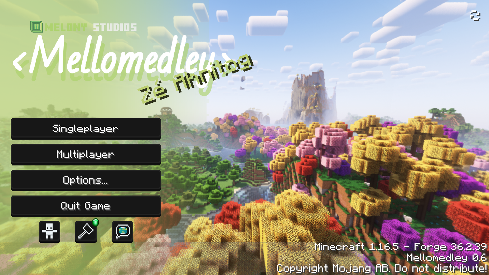

# Mellomedley
**Mellomedley** is a modpack released by *Melony Studios*, which is a collection of most mods released by me, with other mods on top to make a better playing experience.

On total, it has **70** mods, **15** of which are my own, and **1** is a backported from 1.18, Female Gender.

  

| | |
|-|-|
| **Developer(s)** | [isabellawoods](https://github.com/isabellawoods) |
| **Edition** | [*Java Edition*](https://minecraft.wiki/w/Java_Edition) |
| **Release date** | TBA |
| **Modpack version** | 0.4 |
| **Game version** | [1.16.5](https://minecraft.wiki/w/Java_Edition_1.16.5) |
| **Forge version** | 36.2.39 |
| **Total mods** | 70 |

## Mod List
### Melony Mods
- Back Math (**1.9.0.7 Beta**)
- Creeper Edits (**1.3.1**)
- Edits (**1.4.3.8**)
- F10 Elements (**1.4.4**)
- Fabricated F10 (**1.1**)
- Female Gender Mod (**2.9.1**, ported from 1.18)
- In Real Life - Sophie Clothes (**1.2**)
- Mellotech (**1.0.0**)
- Mellow UI (**1.4.2**)
- Mob Taker (**1.4.2**)
- Project Alcook (**1.4.2**)
- Rimcraft (**1.1.2**)
- Sam's Workshop (**1.1.0**)
- Stancements (**0.2**)
- The Mato (**0.3.6 Beta**)
- Revaried (**1.8.0.10**)

### Other Mods
- Antique Atlas (was Map Atlases before)
- Apple Skin
- Architectury API
- Bookshelf
- Botany Pots
- Caelus API
- Charm of Undying
- Chat Heads
- Cloth Config API
- [**CurseForge**] Configured
- [**CurseForge**] Controlling
- Curios API
- [**CurseForge**] Target Dummy (Dummmmmmy)
- Elytra Slot
- Entity Culling
- Fancy Menu
- Ferrite Core
- [**CurseForge**] FTB Backups 2
- [**CurseForge**] FTB Library
- [**CurseForge**] FTB Quests
- [**CurseForge**] FTB Teams
- Global Packs
- Iceberg
- [**CurseForge**] Item Filters
- Jade
- Just Enough Effect Descriptions
- Just Enough Items
- [**CurseForge**] Just Enough Resources
- Konkrete
- [**CurseForge**] Lazy DFU
- Lootr
- Memory Leak Fix
- Modern Fix
- Mouse Tweaks
- NBT Autocomplete
- Not Enough Animations
- Oculus
- Patchouli
- Polymorph
- Prism
- [**CurseForge**] Rhino
- Rubidium
- [**CurseForge**] Searchables
- Shulker Box Slot
- [**CurseForge**] Shut Up Experimental Settings!
- Smarter Villagers
- Spark
- TexTrue's Rubidium Options
- Vein Mining
- Xaero's Minimap
- Xaero's World Map

## Shaders
- Complementary Reimagined

## Resource Packs
- [The Mato Music Pack](/Melony%20Studios%20Wiki/Resource%20Packs/Music%20Packs/The%20Mato%20Music%20Pack.md)
- [Back Math Music Pack](/Melony%20Studios%20Wiki/Resource%20Packs/Music%20Packs/Back%20Math%20Music%20Pack.md)
- [Mellow UI (Dark)](/Melony%20Studios%20Wiki/Resource%20Packs/UI%20Packs/Mellow%20UI%20(Dark).md)
- Mellow UI (Light)
- [**Built-in**] Mellomedley Resources

## Data Packs
- [**Built-in**] Mellomedley Resources