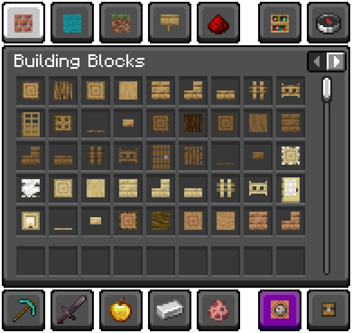

# Major Packs
## Flat Blocks
> *GitHub Page: [isabellawoods/Flat-Blocks](https://github.com/isabellawoods/Flat-Blocks)*

> *"Transforms inventory block models to item models!" - `pack.mcmeta` description*

Flat Blocks is a resource pack that makes block item models into flat textures, which is currently updated to release **26.3 Snapshot 3** (as of 19-08-26).

> 
  

>
> **NOTE**: The different menu in this screenshot is from a resource pack called *Touched UI*.

## Aljan Texture Update
> *Main page:* [Aljan Texture Update](Aljan%20Texture%20Update.md)

> *"Texture update for the Aljan. \[Made on 29-9-24] — `pack.mcmeta` description.*"*

**Aljan Texture Update** is a resource pack that updates the ambience and part of the texturs of the Aljan dimension added by *Back Math* in version `7.0`.

> 

## Recorder Modded Songs
> *Main page:* [Recorder Modded Songs](Recorder%20Modded%20Songs.md)

> *"Record modded songs using the Music Recorder" — `pack.mcmeta` description.*

**Recorder Modded Songs** (stylized as **\[ST] Recorder Modded Songs** in-game) is a resource- and data pack that adds several jukebox songs and recorded disc styles for modded songs.

> 