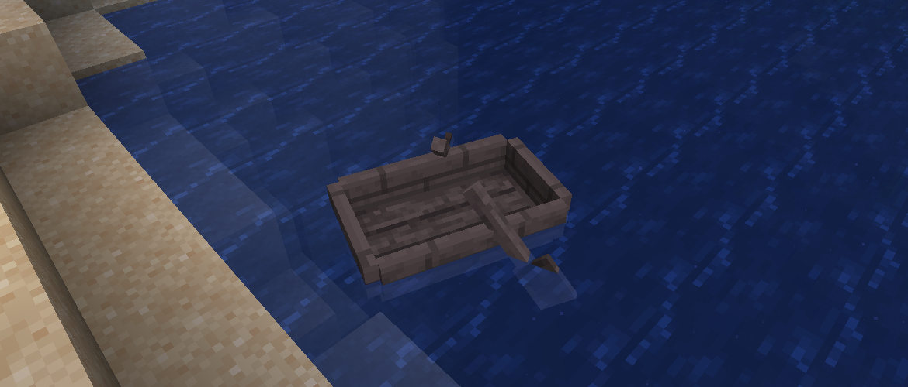

<h1 style="text-align: center;">- Reutilities 1.0.1 -</h1>

> **Written On:** 31-01-26 - **Last Updated:** 01-02-26

**1.0.1** is a minor release for *Reutilities*, released on August 16, 2025.[^1] This was released on the same day as [1.0.0](Changelog%201.0.0.md) to address a crash when making boats with non-oak wood types.

## Changes
### Entities
- The pick result of boats now have the `wood_type` component set.
- The game no longer crashes when creating the models for non-oak boats.

### Items
- Vanilla boats with the `wood_type` component now place down *Reutilities* boats instead of vanilla ones.

## Technical
### Changes
- The mixin file now has a compatibility level of `JAVA_21`, from `JAVA_17`.
- Boat types now use `Supplier<Item>` instead of `ItemLike`.
- `ReEvents` is now a common event class, which probably crashes the game when run on the server.
- `ReBoatItem.getBoatType()` is now static.
- Renamed the following classes:

| Old Name          | New Name    |
| ----------------- | ----------- |
| BoatTypeGetter    | BoatVariant |
| ReClientBusEvents | ReEvents    |

### References
[^1]: ["1.0.1: Fixed Boat-Related Crashes"](https://github.com/isabellawoods/Reutilities/commit/7de724997181742d34e5910cfc6debdc0d0fc23d) (Commit `7de7249`) – GitHub, August 16, 2025.