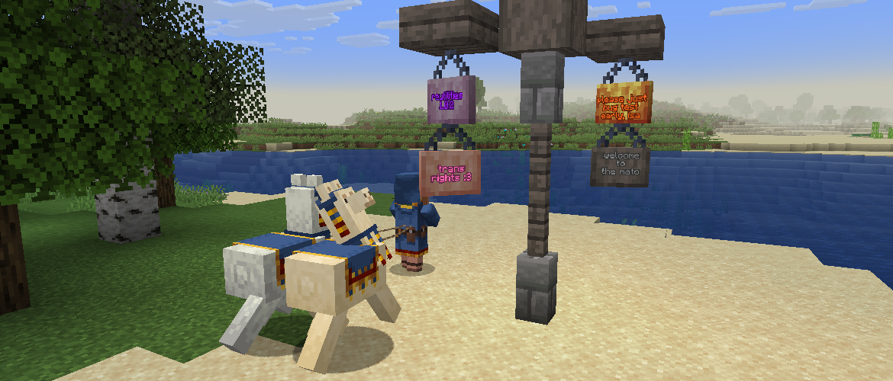

<h1 style="text-align: center;">- Reutilities 1.0.2 -</h1>

> **Written On:** 01-02-26 - **Last Updated:** 01-02-26

**1.0.2** is a minor release for *Reutilities*, released on August 16, 2025.[^1] This was released on the same day as [1.0.0](Changelog%201.0.0.md) to address an issue with signs not recognizing custom wood types properly.

## Changes
### Blocks
- Custom signs and hanging signs are now properly recognized by their respective block entities.
  - The code for this is a bit jank because only mixin'ing into the `BlockEntityType` class seemed to work, even though *NeoForge* has an event for this.

### References
[^1]: ["1.0.2: Fixed Sign-Related Crashes"](https://github.com/isabellawoods/Reutilities/commit/f701cd2a8d1e8314d4ea525a522124f06ebb162a) (Commit `f701cd2`) – GitHub, August 16, 2025.