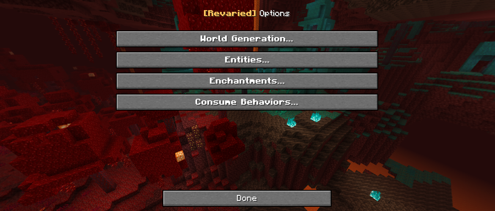

<h1 style="text-align: center;">- Revaried 8.0.10 -</h1>

> **Written On:** 26-07-25 - **Last Updated:** 05-01-26

**8.0.10** is the tenth version for [*Revaried* 8.0.0](/Revaried/Changelogs/1.16.5%20-%201.8.0/Changelog%201.8.0.md), released on November 17, 2025.[^1][^2][^3] It backports the functionality of item behaviors from *Reutilities*, and makes changes to the options screen.

## Hotfixes
- Fixed a crash with chorus flowers/plants when playing with [*Endergetic Expansion*](https://modrinth.com/mod/endergetic).[^2]

## Additions
### Blocks
- Added loot tables to melting beets and wild melting beets.

### Miscellaneous
- Added a translation for the song "Moog City", used by *Mellow UI*.
- **[Bra. Portuguese]** Added translations for the "Dye stains" and "Ink Sac splotches" subtitles.

## Changes
### Blocks
- Removed the **#63 PAINTING** map color. Any blocks that used it now use **#13 WOOD**.

### Items
- Rarities can no longer be changed by using the  **rarity** tag.
  - This is to prioritize *Stancements* updating the rarities to match newer versions.
- Consumable soul lava items now have a blue "Ignite" tooltip.

### Screens
- The panorama overlay now renders on *Revaried*'s options screens.
- The titles in the options screens now use *Mellow UI*'s screen title style ("**[Revaried]** Options **>** Items").
- Notice buttons now only change the color of the text, instead of replacing the button rendering.
- Moved the "Done" buttons 2px down.
- The list background and separators are now set in `init()` instead of `render()`.
- The "saved config" toast now shows up again when changing a config.
- Tooltips now have a maximum width of `170` when *Mellow UI* is loaded, from the default `200`.

### Consume Behaviors
- Most consume behavior now won't write fields with their default values.
- Ported many changes from *Reutilities*' Behavior API into this mod's behaviors:
  - **"Clear Effects"**: renamed `curative_item` to just `item`;
  - **"Eat Item"**: renamed `consumable_item` to just `item`;
  - **"Ignite"**: Added the `tooltip_color` integer field, which controls the color of the "Ablaze" tooltip;
  - **"Add Experience"**: now only runs on the server-side;
  - **"Damage Entity"**:
    - Now checks if the entity is invulnerable, and only runs on the server-side;
    - Added the tooltip from *Back Math*'s damage entity item behavior;
    - When written to JSON, the amount of damage is now `0` if not set.
  - **"Explode"**: Renamed `pos` to `position`, and it's now a *Vector3f* (three doubles) instead of a *BlockPos* (three integers);
  - **"Play Sound"**:
    - Renamed `pos` to `position`, and it's now a *Vector3f* (three doubles) instead of a *BlockPos* (three integers);
    - Renamed `category` to `source`;
    - The `pitch` field is now used for the pitch instead of `volume`;
    - The `useSoundPacket` field has been renamed to `sendSoundPacket`, and is now saved/read from the NBT under  **send_sound_packet**;
    - Sound packets are now used even if the *Forge* sound registry has it (accidental change).
  - **"Remove Effects"**: now includes no effects by default. Before, it would always clear out Poison;
  - **"Teleport Entity"**: most changes here were ported directly from *Reutilities*:
    - Renamed `random_teleport` to `teleport_randomly`, `teleport_position` to `position`, and `teleport_diameter` to `diameter`;
      - `position` now uses the correct name when writing to NBT.
    - `position` is now a *Vector3f* (three doubles) instead of a *BlockPos* (three integers);
    - The custom teleport event now runs when teleport to a specific position;
    - If riding a mob, the entity is now dismounted before teleporting;
    - Now produces particles when teleport to a specific position;
    - Now plays teleportation sounds when teleport to a specific position.

### Miscellaneous
- Fixed a multiplayer crash with rendering the weaponry tab.
  - This is due to data-driven registries not being sent to the client, thus crashing the game when rolling for a random color.
  - Returns a glow black wool sweater if that's the case.
- Removed the *"Revaried:"* prefix from all logged messages.
- Changed all screen-related translations from `gui.`  to `menu.`, and `config.` to `option.`.

## Technical
### Additions
- Properly registered all argument types (potion, use animation, damage source and consume behavior).
- JSON serialization of consume behaviors is now handled by the behaviors, instead of being under `JSONUtils`.
- The description of *Revaried*'s default data pack is now translatable.
- *Revaried* now has a flair accent color: **#FFC55F**, used for *Mellow UI*'s mod list.

### Changes
- Changed the mod version to `8.0.10`, removing the extra `1.16.5-1.` at the beginning.
  - This also makes the update checker find updates properly.
- Updated the Mixin library to `0.8.5`.
- Updated ForgeGradle to `5.1.+`, from `4.1.+`.
- Updated JEI to `7.8.0.1013`.
- Updated the JSON options file to `1810`.
- Updated the jar file name format to match my other mods: `revaried-forge-[version]+1.16.5.jar`.
- *(Stained)LavaBottleItem* now uses ticks instead of seconds for the fire duration.
- The main *Revaried* logger is now called "revaried".
  - Any classes that used loggers now use the main class' logger.
- Removed the access transformers file.
  - This was because either my IntelliJ or *Forge* broke the libraries, so it just doesn't download it (and thus breaks the project).
  - Most of the functionality provided by it was replaces with mixins and/or classes.
- Updated the homepage link on the update checker file.
- Renamed the following classes and methods:

| Old Name                                        | New name                                                           |
| ----------------------------------------------- | ------------------------------------------------------------------ |
| *ConsumeBehavior*`.getBehaviorPropertiesStatic` | *ConsumeBehavior*`.getBehaviorProperties` (overwrote other method) |
| *DamageSourceArgument*`.sources`                | *DamageSourceArgument*`.source`                                    |
| *UseAnimationArgument*`.animations`             | *UseAnimationArgument*`.animation`                                 |
| *VSBlockTags*`.mod`                             | *VSBlockTags*`.revaried`                                           |
| *VSChorusFlowerMixin*                           | *RVChorusFlowerMixin*                                              |
| *VSChorusPlantMixin*                            | *RVChorusPlantMixin*                                               |
| *VSConfigCategoriesScreen*                      | *RVConfigCategoriesScreen*                                         |
| *VSConfigEntries*                               | *RVConfigEntries*                                                  |
| *VSItemStackMixin*                              | *RVItemStackMixin*                                                 |
| *VSJSONConfig*                                  | *RVJSONConfig*                                                     |
| *ConsumableTeleportEvent*                       | *BehaviorTeleportEvent*                                            |

## Tags
### Additions
- Added `#variants:chorus_plant_plantable_on` block tag to `#endergetic:chorus_plantable`.
- Added `#variants:has_ender_nylium` block tag, and all *Revaried* end stone blocks to `#endergetic:ender_fire_base_blocks` block tag.
- Added `#endergetic:end_plantables` block tag to `#variants:end_plants_plantable_on`.

### References
[^1]: ["1.8.0.10 (I): Updated Screens & No Acc. Transformer"](https://github.com/isabellawoods/Revaried/commit/e5aeee2ff1acb9ac717638ff2e1d356943585613) (Commit `e5aeee2`) – GitHub, July 10, 2025.
[^2]: ["Endergetic Expansion Crash Fix"](https://github.com/isabellawoods/Revaried/commit/1093e24c9d04e40c40f63571adcb371019a37516) (Commit `1093e24`) – GitHub, July 20, 2025.
[^3]: ["8.0.10 (Part II): Behaviors Updates from Reutilities"](https://github.com/isabellawoods/Revaried/commit/f1d760a999cab1b4a35105988606a4072fa03b64) (Commit `f1d760a`) – GitHub, November 17, 2025.