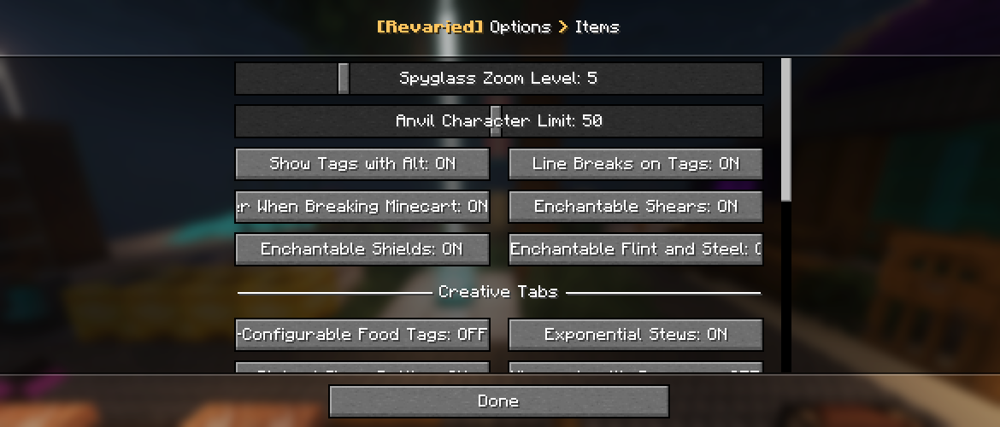

<h1 style="text-align: center;">- Revaried 8.0.11 -</h1>

> **Written On:** 04-01-26 - **Last Updated:** 06-02-26

**8.0.11** is the eleventh version for [*Revaried* 8.0.0](/Revaried/Changelogs/1.16.5%20-%201.8.0/Changelog%201.8.0.md), released on December 12, 2025.[^1] It makes various under the hood technical changes, and finally removes the TOML-based config file in favor of the new JSON-based settings file.

## Additions
### Miscellaneous
- Ported all item configs from the TOML-based config into the new JSON-based one.
  - Added a new category on the settings screen for it.
- Added the `/tagfix` command.
  - Applies all tag fixes available to the item you're holding in your main hand, or to your whole inventory (not implemented).
  - **Syntax**: `tagfix <single_item|whole_inventory> <player>`.
- Added tag fixes (or a part of it, at least).
  - These are used to fix the NBT of items when requires, be it when loaded or when running the `/tagfix` command.
  - Currently, the automatic tag fixing doesn't seem to be working.

### Settings
- Added the `anvil_character_limit` setting, which controls the length of the rename field in the anvil screen.
- Added debug log messages for when the file is saved/read.

## Changes
### Blocks
- Tilling crimson and warped nylium now only works if the block above it is air.
  - This doesn't apply to ender nylium yet.

### Items
- The "color" tooltip of stained glass (panes) now uses all gray text, and has a colored square at the end.
- A flight duration of 1 on firework rockets now appears in red instead of dark red.
- The arrow (">") on enchantment tooltips is now yellow.
- Enchantments with a negative level (if possible) no longer show the level on the tooltip.

### Screens
- All *Revaried* settings screens now use the mod's **"Default Panorama"**.
  - When using *Mellow UI*, the panorama fades in/out when opening/closing one of this mod's settings screens (this is actually broken in this version).
- The "saved changes" toast is now shown only when clicking the "Done" button on the categories screen, and on another settings screen.
  - Using "Esc" to leave the screens will make the settings not be saved to disk, and the toast to not pop up.
- Updated the "saved changes" toast's title and description to one only two lines.
- Added a "Cancel" button to the categories screen, which makes the changes not be saved (but they're still applies anyways).
- Added the "items" settings screen for the newly-ported items config.
  - It uses the separators from *Mellow UI* to categorize the settings in the screen.

### Settings
- If the settings file doesn't have a setting (either removed or added by a new version), the file no longer resets itself.

### Translations
- Added translations for the built-in default panorama, used by *Mellow UI*.
- Changed "1.8.0.3" to "8.0.3" on the "update to 8.0.3" consume behavior fix command.
- Changed the "1.8.X" on the data pack description to "8.0.X".
- Changed all `.desc`s in the setting tooltip translations to `.tooltip`.
- Updated the settings file logger messages to use "settings" instead of "config".
- Slightly adjusted the tooltips for the "Nether Coal Ore" and "Crystallized Magma Cream Ore" world generation settings.
- Updated the "Hold \<Alt> for NBT" tooltip to "Hold [Alt] for Tags", to match *Reutilities*.
- **[English]** The duration factor tooltip now shows the value after the text, instead of before.
- **[Bra. Portuguese]** Replaced the hyphen (-) in the "dog" music disc and "Moog City" descriptions with an em dash (—).
- **[Bra. Portuguese]** Changed the key binds category to "Estúdios Melony".

## Technical
### Additions
- The  **color** field of wool armor color definitions now accepts hexadecimal values prefixed with `#`.
  - By default, the data generator uses the hexadecimal format.
- Added a built-in panorama under `variants:default_panorama`, used by *Mellow UI* for this mod's settings screens.
  - Currently, it points to the wrong texture location.
- *NBTSavingRecipeBuilder* now accepts *Forge*'s recipe conditions.
- Added descriptions of the newer updates to the update checker file.

### Changes
- Renamed the `variants:design` model override to `variants:armor_design`.
- Renamed the `variants:texture_id` random range to `variants:stew_texture_id`.
  - Updated the `set_stew_bowl` example loot table to use `8.0.11` as it was updated.
- Renamed the `variants:stew_behavior` registry to `variants:consume_behavior`.
  - The registry's legacy name is now its old name.
- The `consumable.behavior` field is no longer saved to JSON if it's empty.
- Data generator names now use an em dash (—) instead of a hyphen (-).
- Bowl types no longer produce a duplicate "duplicate texture id" message in the logs.
- Maps for *Revaried*'s data-driven registries are now cleared when data packs are (re)loaded.
- Renamed the following classes and methods:
  - Also includes all mixins starting with "VS", which now use "RV".
  - Split both mixins inside *EntityTameItemMixins* into separate classes.

| Old Name                               | New Name                                     |
| -------------------------------------- | -------------------------------------------- |
| *BehaviorParser*`.getBehavior`         | *BehaviorParser*`.behavior`                  |
| *BehaviorParser*`.getProperties`       | *BehaviorParser*`.properties`                |
| *BowlType*`.createBowlTypeSerializer`  | *BowlTypeManager*`.createBowlTypeSerializer` |
| *BowlType*`.getAssetID`                | *BowlType*`.assetID`                         |
| *BowlType*`.getBowlStack`              | *BowlType*`.bowl`                            |
| *BowlType*`.getTextureID`              | *BowlType*`.textureID`                       |
| *BowlType*`.getWoodName`               | *BowlType*`.name`                            |
| *ConsumableItem*`.getBehavior`         | *ConsumableItem*`.behavior`                  |
| *ConsumableItem*`.usesDefaultBehavior` | *ConsumableItem*`.useDefaultBehavior`        |
| *ConsumeBehaviorTags*`.variants`       | *ConsumeBehaviorTags*`.revaried`             |
| *GlassType*`.getBottle`                | *GlassType*`.bottle`                         |
| *GlassType*`.getName`                  | *GlassType*`.name`                           |
| *GlassType*`.getTextureIdentifier`     | *GlassType*`.textureID`                      |
| *TagFixTags*`.variants`                | *TagFixTags*`.revaried`                      |
| *Variants*`.loadConfig`                | *RVSettingsManager*`.load`                   |
| *Variants*`.saveConfig`                | *RVSettingsManager*`.save`                   |
| *Variants*`.updateConfig`              | *RVSettingsManager*`.upgradeSettings`        |
| *VSEvents*`.onResourceReload`          | *VSEvents*`.registerDataDrivenRegistries`    |
| *VSItemModelModels*`.textureID`        | *VSUtils*`.textureID`                        |
| *VSItemModelModels*`.armorDesign`      | *VSUtils*`.armorDesign`                      |
| *VSItemModelModels*`.mobID`            | *VSUtils*`.mobID`                            |
| *VSUtils*`.addArmorDesigns`            | *VSUtils*`.addDesignedArmorProperties`       |
| *VSUtils*`.makeBow`                    | *VSUtils*`.addBowProperties`                 |
| *VSUtils*`.makeShield`                 | *VSUtils*`.addShieldProperties`              |
| *VSUtils*`.addSpawnerMinecartMobs`     | *VSUtils*`.addSpawnerMinecartProperties`     |
| *VSUtils*`.addTextureIdentifier`       | *VSUtils*`.addTextureIdentifierProperty`     |
| *BowlIDValueRange*                     | *StewTextureIDValueRange*                    |
| *RVJSONConfig*                         | *RVSettings*                                 |
| *VSAnvilMenuMixin*                     | *RVAnvilScreenMixin*                         |
| *VSCriteriaTriggers*                   | *RVCriteriaTriggers*                         |
| *VSFilledMapItem*                      | *RVFilledItemMapMixin*                       |
| *VSModdedItems*                        | *RVModdedItems*                              |
| *VSRegistries*                         | *RVRegistries*                               |
| *VSTagFixes*                           | *RVTagFixes*                                 |

### Removals
- Removed the following classes:
  - `VSAbstractListMixin`;
  - `VSCommonConfigs`;
  - `VSConfigs`.

## Tags
### Changes
- Renamed the following block tags:
  - `#variants:chorus_flower_plantable_on` to `#variants:may_place_on/chorus_flower`;
  - `#variants:chorus_plant_plantable_on` to `#variants:may_place_on/chorus_plant`;
  - `#variants:end_plants_plantable_on` to `#variants:may_place_on/end_plants`;
  - `#variants:ender_wart_plantable_on` to `#variants:may_place_on/ender_wart`;
  - `#variants:golden_carrots_plantable_on` to `#variants:may_place_on/golden_carrots`;
  - `#variants:nether_crops_plantable_on` to `#variants:may_place_on/nether_crops`;
  - `#variants:nether_wart_plantable_on` to `#variants:may_place_on/nether_wart`;
  - `#variants:warping_vines_feature_can_place_on` to `#variants:may_place_on/warping_vines_feature`;
  - `#variants:worldgen/plants_placeable_on` to `#variants:may_place_on/plants`;
- Added "correct ender bowl" to the `#variants:applies_on_tag_reload` tag fix tag.

### References
[^1]: ["8.0.11: Finished JSON Config Port & (Half) Tag Fixes"](https://github.com/isabellawoods/Revaried/commit/f9c98e31bf90b582be3d8cbce3f9f4111237c94c) (Commit `f9c98e3`) – GitHub, December 12, 2025.