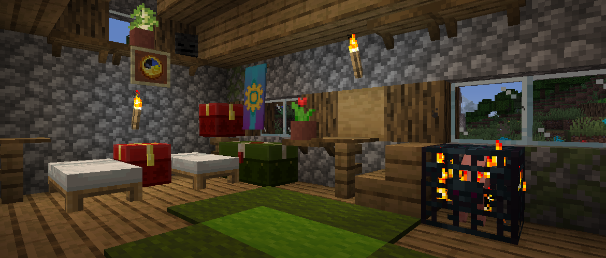

<h1 style="text-align: center;">- Stancements 0.1 -</h1>

> **Written On:** 24-12-25 - **Last Updated:** 01-02-26

**0.1** is a first release of *Stancements*, released on February 5, 2025[^1], with an extra update on February 14, 2025[^2]. It adds shelves, many backports ported from the discontinued *Melony Lib*, and updated iron block sounds.

## Additions
### Blocks
- Added shelves.
  - Shelves are decorative blocks that span half a block. Small blocks, such as flower pots and torches, can be placed on top of them, but hanging off on one side.
  - Places itself attached to nearby blocks, like a ladder.
  - Are crafted using 3 planks and 2 sticks in the shape of a helmet, and gives 3 shelves.
  - Can be waterlogged.

### Miscellaneous
- Added a common config file, containing the following **6** configs:
  - `populatePaintingVariants`: Whether to add all painting variants to the creative tabs;
  - `populateFireworkRocketDuration`: Whether to add all 3 flight durations of firework rockets to the creative tabs;
  - `addOminousBannerToTab`: Adds the ominous banner after black banners in the "Decoration" tab. This banner has a yellow name, unlike 1.16's which has an orange name;
  - `addTermianEmpireBannerToTab`: Adds the Termian Empire banner after ominous banners in the "Decoration" tab. Only added if *Back Math* is loaded;
  - `addBeehiveTooltips`: Adds the honey level and bees tooltips to bee nests and beehives;
  - `removePotionGlint`: Removes the enchantment glint from potions, splash potions and lingering potions.
- Added the "Spawn Eggs" creative tab.
  - Contains monster spawners and all spawn eggs.
  - Uses the pig spawn egg for an icon, unlike in 1.21.5.

## Changes
### Blocks
- Backported the block sound types of the following blocks:
  - "Iron" for any block in the `#melony:makes_iron_sounds` block tag.
  - "Sponge" for sponges;
  - "Wet sponge" for wet sponges;
  - "Cobweb" for cobwebs;
  - "Spawner" for monster spawners;
  - "Vine" for vines;
  - "Lily pad" for lily pads.
- Changed some sounds for the following blocks:
  - `AnvilBlock`s now use the updated iron sounds for breaking, stepping, etc.
  - Levers, repeaters and comparators now use "Stone";
  - Jukeboxes and tripwire hooks now use "Wood".
- Renamed "Grass" to "Short Grass", from 1.20.3.
  - "Potted Grass", added by *Revaried*, has been renamed to "Potted Short Grass".
- Renamed "Lapis Lazuli Block" to "Block of Lapis Lazuli", from 1.17.
- Renamed "Spawner" to "Monster Spawner", from 1.19.3.

### Items
- Paintings now have tooltips showing their name, author and size, like in newer versions.
  - Displays "Random variant" if the  **Motive** tag is absent.
- Items with durability no longer have the `"Damage": 0` tag always present.
- Shears now use the `#melony:mineable/shears` block tag for which blocks they can break.
- Moved all spawn eggs from the "Miscellaneous" tab to the new "Spawn Eggs" tab.
- Renamed "Scute" to "Turtle Scute", from 1.20.5.
- Renamed "Minecart with Spawner", added by *Revaried*, to "Minecart with Monster Spawner".
- Changed the axe stripping subtitle from "Axe scrapes" to "Axe strips", from 1.17.
- Changed the painting being broken subtitle from "Painting breaks" to "Painting broken", from 1.20.5.

## Tags
### Additions
- Added the `#melony:makes_iron_sounds` block tag.
  - Contains `#forge:storage_blocks/iron`, iron bars, doors, trapdoors, heavy weighted pressure plates, cauldrons and hoppers.
  - Blocks in this tag use the updated iron sounds from [25w02a](https://minecraft.wiki/w/Java_Edition_25w02a).
- Added the `#melony:mineable/shears` block tag.
  - Contains `#minecraft:leaves`, `#minecraft:wool`, cobwebs, short grass, ferns, dead bushes, vines, tripwire and redstone wire.
  - Blocks in this tag can be mined faster using shears.
- Added the `#stancements:shelves` block and item tags, containing all shelves.
- Added the `#melony:with_rarity/common` item tag.
  - Contains End crystals and golden apples.
  - Items in this tag use the "Common" rarity.
- Added the `#melony:with_rarity/uncommon` item tag.
  - Contains "snout" banner patterns, chainmail armor, nautilus shells, conduits, and the following music discs:
    - 13, cat, blocks, chirp, far, mall, mellohi, stal, strad, ward, 11 and wait.
  - Items in this tag use the "Uncommon" rarity.
- Added the `#melony:with_rarity/rare` item tag.
  - Contains enchanted golden apples, tridents, Nether stars, wither skeleton skulls, and "skull charge" and "thing" banner patterns.
  - Items in this tag use the "Rare" rarity.
- Added the `#melony:with_rarity/epic` item tag.
  - Contains elytra, dragon heads, barriers, structure voids, command block minecarts, debug sticks and knowledge books.
  - When *Revaried* is loaded, debug bows, debug arrows, and enchanted knowledge books are also included.
  - Items in this tag use the "Epic" rarity.
- Added the `#melony:with_rarity/potato` item tag.
  - Items in this tag use the "Potato" (green) rarity from snapshot [24w14potato](https://minecraft.wiki/w/Java_Edition_24w14potato).

### References
[^1]: ["Initial Commit for Stancements"](https://github.com/isabellawoods/Stancements/commit/649500f538a6057c30e16abec09a1769b3ed190e) (Commit `649500f`) – GitHub, February 5, 2025.
[^2]: ["Switched `makes_iron_sounds` to Forge Tag"](https://github.com/isabellawoods/Stancements/commit/1abf66ee7426868f5529399e0dfe2a4e9a73ca8f) (Commit `1abf66e`) – GitHub, February 14, 2025.