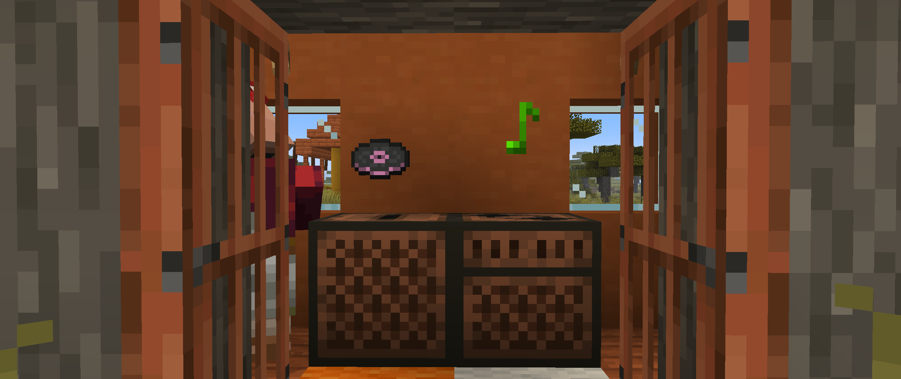

<h1 style="text-align: center;">- Stancements 0.2.0 -</h1>

> **Written On:** 23-12-25 - **Last Updated:** 23-12-25

**0.2.0** is a major release for *Stancements*, released on August 30, 2025.[^1][^2] This is the first version released for *NeoForge* 1.21.1. This changelog will document the differences between this 1.21.1 release and the 1.16.5 **0.2.1** release.

This is the first version to be released on 1.21.

## Additions
### Items
- Vinyl discs can now be obtained by clearing recorded discs in the crafting menu.

### Miscellaneous
- Added translations for all tags added by this mod.

## Changes
### Blocks
- The music recorder's particles now have randomized colors.
- Shelves and music recorders can now be used as fuel, lasting for 1.5 seconds.
- Changed the way recording music works:
  - Recording songs now uses **jukebox songs** for the music, instead of making a new sound instance for playing any `.ogg` file loaded.
    - All jukebox songs have their comparator output set to `0`.
  - This new system is more limited, but allows other players to hear the music as well.
  - Includes every song playable in the game (even from 1.21.6), except the title screen tracks and "Alpha".
  - "Broken Clocks" has been erroneously saved as `broken_blocks`.
- Hoppers (or other things that access inventories) can no longer interact with the music recorder.
- The following mixins have been removed as they're ports of now existing vanilla features:
  - Ominous banners coming after black banners;
  - Termian Empire banners coming after ominous banners (*Back Math* now does this);
  - Block sound backports;
  - Honey level and amount of bees in bee nests and beehives (from 1.21.4).

### Items
- The following mixins have been removed as they're ports of now existing vanilla features:
  - All 3 flight durations of firework rockets;
  - All variants of paintings;
  - Potions not having the enchantment glint;
  - Updated item rarities (from 1.21.2).
- Item rarities can no longer be controlled by the `#melony:with_rarity/<name>` item tags.
- Label **11** can now be obtained when recording music.

## Removals
- Removed the "Spawn Eggs" creative tab, as it now exists in vanilla.
- Removed all updated block sounds from the mod's jar file.

## Technical
### Additions
- *Reutilities* `1.2.0` is now a dependency of this mod.
- Added recipe advancements for all recipes in the mod.
- All shelf recipes are now grouped together.
- Added the `music_id` and `label` data components, which replace the NBT tags of the same name.

### Changes
- Changed version from `0.2` to `0.2.0`.
- Swapped *Forge* version `36.2.39` for *NeoForge* version `21.1.179`.
- Updated *Just Enough Items* to `19.22.0.315`.
- Renamed `STEventBusEvents` to `STEvents`.

## Tags
### Additions
- Added the `#stancements:vinyl_disc_dyes` item tag.
  - Contains `#c:dyes/light_gray` and `#c:dyes/gray`.
  - Items in this tag are used as an ingredient to craft vinyl discs.

### Changes
- Added the music recorder and the `#stancements:shelves` block tag to `#minecraft:mineable/axe`.
- Renamed the `#melony:mineable/shears` block tag to `#c:mineable/shears`.
- Added hanging roots and glow lichen to the `#c:mineable/shears` block tag.
- Added crimson and warped shelves to the `#minecraft:non_flammable_wood` item tag.
- Added vinyl and recorded discs to the `#c:music_discs` item tag, as `#minecraft:music_discs` has been removed.
- Added recorded discs to the `#minecraft:dyeable` item tag.

### Removals
- Removed redstone wire from the `#c:mineable/shears` block tag.
- Removed the following block tag:
  - `#melony:uses_sounds/iron`.
- Removed the following item tags:
  - `#melony:with_rarity/common`;
  - `#melony:with_rarity/uncommon`;
  - `#melony:with_rarity/rare`;
  - `#melony:with_rarity/epic`;
  - `#melony:with_rarity/potato`.

### References
[^1]: ["0.2.0: Initial Commit for 1.21.1"](https://github.com/isabellawoods/Stancements/commit/f15b872970715bc3f4a93efac10b2229061bd83b) (Commit `f15b872`) – GitHub, August 29, 2025.
[^1]: ["Fixed Recorded Discs & Removed Block Sounds"](https://github.com/isabellawoods/Stancements/commit/119b30a42cb026de332fdab5b16a4715b49e7c96) (Commit `119b30a`) – GitHub, August 30, 2025.