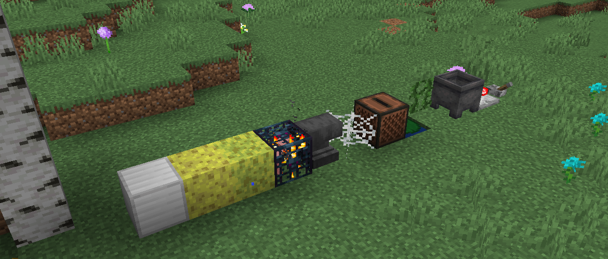

<h1 style="text-align: center;">- Stancements 0.2.1 -</h1>

> **Written On:** 24-12-25 - **Last Updated:** 24-12-25

**0.2.1** is a minor release for *Stancements*, released on July 20, 2025[^1] that fixes a tag-related crash with *Atum 2*.

This is the last version to be released on 1.16.

## Technical
### Changes
- Updated *Just Enough Items* to `7.8.0.1013`, from `7.7.1.126`.
- Updated *Mixin* to `0.8.4`, from `0.8`.
- `STBlockMixin` now checks whether block tags are available before replacing the block sound types (fixes a crash with *Atum 2* in Valhelsia 3).

### References
[^1]: ["0.2.1: Fixes for Valhelsia 3"](https://github.com/isabellawoods/Stancements/commit/73c4a942f2efd7229ead4a2bf7c5fcbfe0a147ad) (Commit `73c4a94`) – GitHub, July 20, 2025.