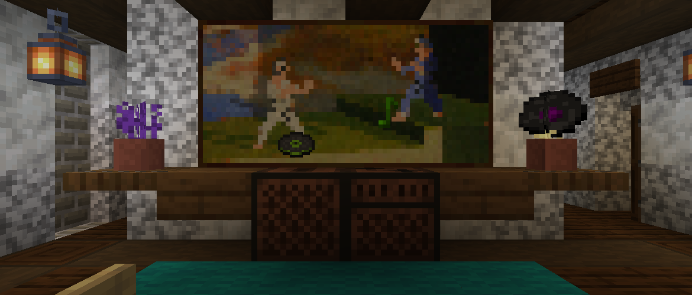

<h1 style="text-align: center;">- Stancements 0.2 -</h1>

> **Written On:** 24-12-25 - **Last Updated:** 01-02-26

**0.2** is a major release for *Stancements*, released on June 29, 2025.[^1] It adds the music recorder, along with its vinyl and recorded discs.

## Additions
### Blocks
- Added the music recorder.
  - Records ambient music playing to you using **vinyl discs**.
  - Recordings only take 30 seconds, instead of lasting the entire song.
  - When a recording is finished, right-click the recorder to pop out the **recorded disc**.
    - The color and label of these discs is randomized when the recording finishes.
  - Right-clicking the block during the recording cancels it and pops the vinyl disc out.
  - Hoppers can insert and extract discs from this block, but cannot start recordings.
  - Emits a redstone signal while recording, and comparators can check how long until the recording finishes.

### Items
- Added vinyl discs.
  - Used to record songs with the music recorder.
  - Crafted with 2 coal/charcoal, 1 light gray/gray dye, and 1 honeycomb in a 2x2 square.
  - Can stack up to 16.
- Added recorded discs.
  - Recorded discs are obtained from recording music.
  - Unlike regular music discs, these use the direct location of the `.ogg` file to play the music. Because of this, the music is only played in singleplayer.
    - But on the bright side, this system works with **any song being played**, and is not hardcoded to the vanilla songs.
  - Its color and label are randomized when the recording finishes.
  - Has **11** different label types, each coming from a vanilla music disc texture.
    - Label **5** uses the texture of label **1**. This won't be fixed until version [0.3.2](Changelog%200.3.2.md).
    - Due to an offset in the code, only labels 0-10 are produced (with `0` being a duplicate of `1`).
  - Has uncommon rarity and can only stack to 1.

### Miscellaneous
- Added the "Songs Recorded" statistic, tracking exactly that.

## Technical
### Additions
- Added the `music_recorder` block entity, with the following fields:
  -  **item**: The vinyl/recorded disc item stack.
    - **Tags common to all items saved by *Revaried*:**
    -  **id**: The id of the item.
    -  **count**: *(optional)* How many items there are in this stack. Effectively capped at `127` due to the default count tag being a  byte.
    -  **tags**: *(optional)* The tags this item stack has.
  -  **music_id**: The resource location of the song being recorded. Usually, it's the path to the `.ogg` file.
  -  **ticks_until_finished_recording**: The amount of time, in ticks, until the recording is finished. Set to `600` (30 seconds) when recording a song, and is `-1` otherwise.
  -  **recorder_player**: *(optional)* The UUID of the player recording this song. Used to send action bar messages saying the recording has finished.
  -  **recording**: *(optional)* Whether this block entity is recording a song.

### Changes
- *Stancements*' data pack's description is now translatable.

## Tags
### Changes
- Renamed the `#melony:makes_iron_sounds` block tag to `#melony:uses_sounds/iron`.
- Added `#minecraft:cauldrons` (from *The Mato*) to the `#melony:uses_sounds/iron` block tag.
- Added vinyl and recorded discs to the `#minecraft:music_discs` item tag.

### References
[^1]: ["0.2: Added the Music Recorder"](https://github.com/isabellawoods/Stancements/commit/6f3293db25a13703d6be7da9ad4e835ce605b47a) (Commit `6f3293d`) – GitHub, June 29, 2025.