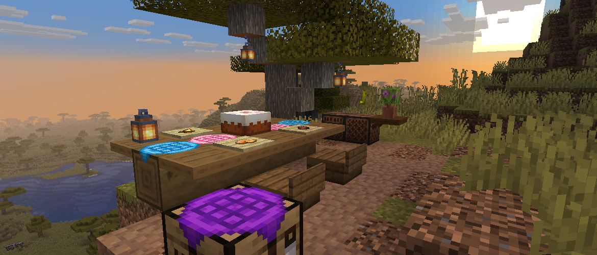

<h1 style="text-align: center;">- Stancements 0.3.0 -</h1>

> **Written On:** 23-12-25 - **Last Updated:** 23-12-25

**0.3.0** is a major release for *Stancements*, released on September 3, 2025.[^1] It adds crafting table cloths for decorating the top of workstations, and overhauls the appearance of shelves.

## Additions
### Blocks
- Added crafting table cloths
  - These are purely decorative blocks that can be put on top of anything.
  - These do block access to the workstation below them.
  - Crafted using two carpets of the same color on a horizontal line.
  - Like carpets, they can be used as fuel in furnaces, lasting for 0.335 seconds.
- Added mangrove, cherry and bamboo shelves.

## Changes
### Blocks
- Updated the textures, models and hitboxes of shelves.
- Shelves no longer attach themselves to a nearby block like ladders. They are now directional like other blocks.

### Items
- The default recorded disc instance can no longer shows its color tooltip.

## Technical
### Additions
- Added the `/melonystudios stancements update_recorded_disc` command.
  - Updates the music id and label from 1.16's NBT to 1.21's data components.
  - Targets the item in the player's main hand.

### Changes
- "Broken Clocks" now has the correct sound event and jukebox song id (`game/broken_clocks` instead of `game/broken_blocks`).
- The `music_id` data component is now a resource location instead of a string.
- Renamed `STStats` to `STStatistics`.

## Tags
### Additions
- Added all crafting table cloths to the `#stancements:crafting_table_cloths` block and item tags.

### Changes
- Added the mangrove, cherry and bamboo shelves to the `#stancements:shelves` block and item tags.
- Added the `#stancements:crafting_table_cloths` block tag to `#minecraft:combination_step_sound_blocks` and `#minecraft:dampens_vibrations`.

### References
[^1]: ["0.3.0: Crafting Table Cloths & Updated Shelves"](https://github.com/isabellawoods/Stancements/commit/2b2e1edc84ee8e12c3b2cf4baa8f131c37476f9c) (Commit `2b2e1ed`) – GitHub, September 3, 2025.