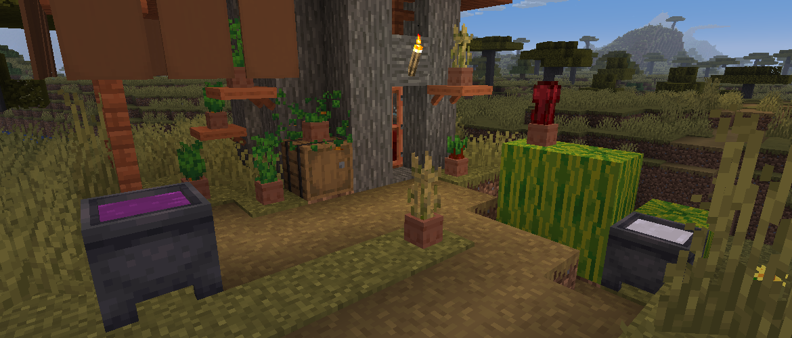

<h1 style="text-align: center;">- Stancements 0.3.1 -</h1>

> **Written On:** 23-12-25 - **Last Updated:** 25-04-26

**0.3.1** is a major release for *Stancements*, released on September 21, 2025.[^1] It adds crop pots from *JTW Labs* with a fresh new coat of paint, as well as the cauldrons from *The Mato*.

## Additions
### Blocks
- Added crop pots.
  - Crop pots can hold one plant. It doesn't need water to grow, and it grows faster than regular farmland (1/15 versus 1/25).
  - Can hold any of these crops: wheat, carrots, potatoes, beetroot and Nether wart.
  - Crops can be removed by shift-right-clicking a filled crop pot.
  - Has a hopping variant that automatically harvests the crop, and puts the dropped items into the container below (if possible).
  - Only drops one of the seed when broken.
  - Can be crafted using 3 uncolored terracotta in a V shape, giving 8 pots.
  - The hopping variant can be crafted using 8 pots and 1 hopper, or 3 uncolored terracotta and 1 hopper in a V shape.
  - Were ported over from the discontinued *JTW Labs*.
- Added dyed water and milk cauldrons.
  - Function like any other cauldron in the game.
  - Dyed water cauldrons use block entities to store their liquid color, but it doesn't survive a reload since the client doesn't have access to the block entity data.
  - Dyed water cauldrons can fill up with water when exposed to rain.
  - Any items in the `#minecraft:dyeable` item tag can be dyed using the dyed water cauldron.
  - Were ported over from *The Mato*.
- Hoppers can once again insert and extract items from music recorders.
- Crafting table cloths can now be crafted from dyeing other table cloths (except blue).
- Concrete can now be crafted from 8 concrete powder and a water bucket (except blue).

### Items
- Added dyed water buckets.
  - These buckets store water with any amount of dyes.
  - This mod's creative tabs has buckets for all 16 default colors, as well as inno and glow black when their respective mods are present.
  - All bucket colors show up in *Just Enough Items*.

### Miscellaneous
- Added a common config file, with these **2** configs:
  - `populateDyedWaterBuckets`: Whether to all all colors of dyed water buckets to the mod's creative tab. Defaults to `true`;
  - `cropPotGrowthChance`: Defines the chance of a filled crop pot advancing its growth stage. Defaults to `15` for crop pots and `25` for vanilla farmland.
- Added the "Seeds Planted in Crop Pots" statistic, tracking exactly that.
- Added a new sound event: `item.cauldron.dye` ("Water splashes").

## Changes
### Blocks
- Banners can now be equipped on the head slot of entities by default.
- Interacting with music recorders now sends the "block change" game event.
- The comparator output of the recording duration is now accurate.
- The music recorder now shows up at the top of the mod's creative tab.

## Technical
### Additions
- Added the [`pot_plantable`](Stancements/Docs/Pot%20Plantables.md) item data map.
  - Maps the seed items to their respective crop pots ( **crop_pot**) and placing sounds ( **planting_sound**).
- Added the `dyed_water_cauldron` block entity, with the following field:
  -  **dyed_water_color**: The color of the water on this cauldron.

### Changes
- The `label` component's error message is now translatable.
- The recording logic is now handled entirely by the `MusicRecorderBlock` class.

### Removals
- Removed the  **recording** tag from the music recorder block entity, as it only uses the block state now.

## Tags
### Additions
- Added the `#stancements:crop_pots` block tag, containing all crop pots.
- Added the `#stancements:recordable_discs` item tag.
  - Contains vinyl discs.
  - Items in this tag can be used on music recorder to record ambient songs.
- Added the `#c:buckets/dyed_water` item tag, containing dyed water buckets.

### Changes
- Added dyed water and milk cauldrons to the `#c:villager_job_sites` and `#minecraft:cauldrons` block tags.
- Added the `#stancements:crop_pots` block tag to `#minecraft:mineable/pickaxe`.
- Added all crafting table cloths to the `#c:dyed/<color>` block and item tags.
- Added dyed water buckets to the `#minecraft:dyeable` item tag.
- Added the `#c:buckets/dyed_water` item tag to `#c:buckets`.

### References
[^1]: ["0.3.1: The Mato Cauldrons & JTW Labs Crop Pots"](https://github.com/isabellawoods/Stancements/commit/313ecfcd4d6ce763588a8e0172a4076f79f607a3) (Commit `313ecfc`) – GitHub, September 21, 2025.