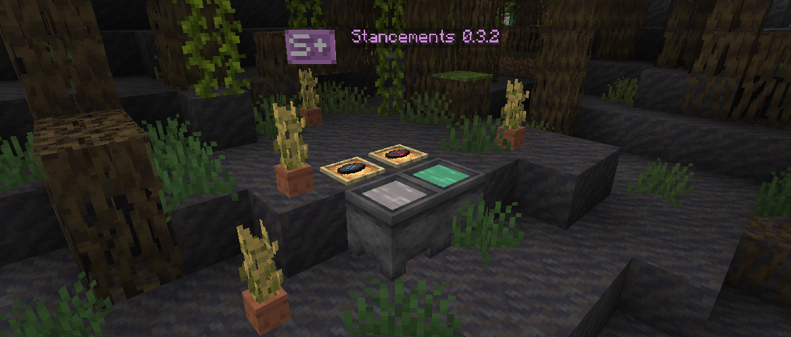

<h1 style="text-align: center;">- Stancements 0.3.2 -</h1>

> **Written On:** 23-12-25 - **Last Updated:** 05-01-26

**0.3.2** is a major release for *Stancements*, released on November 9, 2025.[^1] It makes music recorder able to record from adjacent jukeboxes, and adds compatibility with [*Jade*](https://modrinth.com/mod/jade).

## Additions
### Items
- Added the shortened *Stancements* logo as an item.
  - Its sole purpose is to server as a creative tab icon, and mod entry icon when using *Catalogue*.
  - It's fireproof and has an "epic" rarity.
- Added two new recorded disc labels: **C418 - wait** (`13`) and **Hyper Potions - Lava Chicken** (`14`).
- The inno and glow black dyed water buckets now appear by default in the creative tab.

### Miscellaneous
- Added compatibility with *Jade*.
- Added **4** new advancements:
  - `Radio Recording` (goal): Record any song using the Music Recorder;
  - `Miner's Music Group`: Record all songs playable in-game using the Music Recorder;
    - Challenge advancement, grants 150 experience points.
  - `Bonsai Plantation`: Plant a seed in a Crop Pot;
  - `Hopping Potables`: Plant a seed in a Hopping Crop Pot.
- Added the **Add Items to Vanilla Tabs** option, which defaults to `false`. It adds all of the mod's items into the vanilla creative tabs.

## Changes
### Blocks
- The crafting table cloth block type is now registered.
- Placing a seed on a crop pot now triggers the "Item Used on Block" trigger.

#### Music Recorder
- It can now record music discs from adjacent jukeboxes.
  - The duration of the recording is the same as the length of the disc.
  - Recorded music discs are marked as **copies**, which cannot be recorded again unless the original disc is used.
  - Hoppers inserting vinyl discs try recording from adjacent jukeboxes.
  - Recording ambient music takes precedence over recording music discs.
  - Comparators only start decreasing their signal when in the last 30 seconds.
- When using *Jade*, it now displays the song being recorded, and the remaining time.
- Added a tooltip to show how to use the block.
- All positive tooltips related to it now use *Stancements*' accent color.
- The "Songs Recorded" statistic now increases when a recording finishes, and not when inserting a vinyl disc.
- Placing one with a non-zero recording time now sets its `recording` state to `true`.
- Its recipe now requires 4 planks (corners), 2 dyes (left and right), 2 redstone dust (top and bottom) and one diamond (center), and is now unlocked by obtaining a diamond.

### Items
- The disc label `5` now uses the correct label, instead of `1`.
- Putting dyed water in a cauldron now places the correct cauldron block.

### Miscellaneous
- Updated the logo of the mod to be pixel consistent.
- "Comforting Memories" and "Puzzlebox" music discs now have the correct length.
- The `update_recorded_disc` command now hides the "color" tooltip from the `minecraft:dyed_color` component.

### Translations
- The "Edit" buttons in the mod's options screen is now translated.
- **\[Bra. Portuguese]** Renamed all crop pots to "vasos", from "potes".
- **\[Bra. Portuguese]** Renamed all shelves to "prateleiras", from "estantes".
- **\[Bra. Portuguese]** Updated the names of spruce and birch wood on the shelves.
- **\[Bra. Portuguese]** Replaced the hyphen (-) in the recorded disc names with an em dash (—).

## Technical
### Additions
- Added the `recorded_disc_styles` jukebox song data map.
  - This map controls defines a label color and style for any jukebox songs that are recorded.
  - By default, all vanilla music discs have their styles set. Modded discs will be randomized.
- Added the `music_data` data component.
  - Stores the music id (`id`, optional), and whether this disc is a copy (`copied`, optional).
  - The `music_id` component still exists for discs that already had it, but it is no longer used by the code.
  - Adds the "Copied can't be recorded" tooltip.
- Added the `record_song` criteria trigger for the "Miner's Music Group" advancement:
  - Requires the `music_id`, and whether it's `copying_song`. It also accepts a player predicate.

### Changes
- Updated *NeoForge* to `21.1.209`.
- Updated *Reutilities* to `1.3.0`.
- Updated *Just Enough Items* to `19.25.0.321`.
- Data generator names now use an em dash (—) instead of a hyphen (-).
- Renamed the `pot_plantable` item data map to `pot_plantables`.
- The `label` data component now has a range of 1-13, from 1-11.
- Added a  **copying_song** tag to the music recorder block entity, which marks recorded discs as copies.
- Merged `STNeoForgeEvents` with `STEvents`, as the bus of event subscribers is now deprecated.
- Renamed `STVanillaCompatibility` to `STCompatibility`.
- Renamed `PotPlantable` to `PotPlantables`.

## Tags
### Additions
- Added the *Stancements* logo item to the `#c:logos` item tag.

### References
[^1]: ["0.3.2: Disc Recording & Advancements"](https://github.com/isabellawoods/Stancements/commit/b098ae27c9ead7138b5f7e4043ad295a5bf0bb54) (Commit `b098ae2`) – GitHub, November 9, 2025.