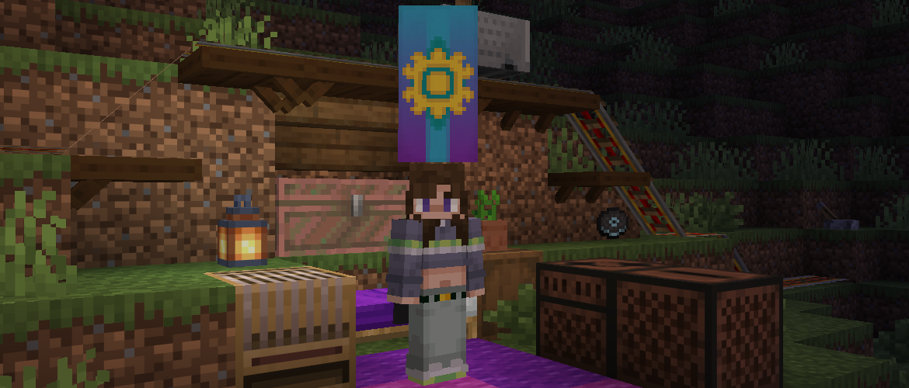

<h1 style="text-align: center;">- Stancements 0.4.1 -</h1>

> **Written On:** 22-04-26 - **Last Updated:** 22-04-26

**0.4.1** is a major version of *Stancements* released on April 20, 2026.[^1] This is the first version released on *NeoForge* 26.1.2. This changelog will document the differences between **0.4.1** on 1.21 and 26.1.

## Changes
### Blocks
- Gilded rails no longer work, as most of the code behind them has been reworked in newer versions.
- Banners now have the `minecraft:equippable` component (port of the mixin). This makes them wearable on an entity's head.

### Items
- Recorded discs now use the `minecraft:tooltip_display` component to hide its label color.
- Blocks breakable by shears is no longer controlled by the `#c:mineable/shears` block tag (it still exists though).

### Miscellaneous
- Updated the README to say "26.1.X" instead of "1.21.1".

## Removals
### Miscellaneous
- Removed the translations for all vanilla ambient songs, as *Minecraft* now has them.

## Technical
### Additions
- Added the `reutilities:hide_components` component.
  - **Format**: a **list of identifiers** that hide specific parts of the item's tooltip (defined in code).
  - Copied from *Reutilities* as it hasn't been ported to 26.1 yet.

### Changes
- Jukebox song definitions for vanilla songs are now located in the `minecraft` namespace, rather than in `stancements`.
  - Unfortunately, there's no fixer for this change, so discs from older versions will be removed.
- Crop pots now use less block models for their growth stages.
- The models of crafting table cloths now render using forced translucency.
  - This was an accidental change and, visually, is the same as in 1.21.
- The data map generator is now called "Stancements — DataProvider Maps" (accidental change).
- Updated *NeoForge* to `26.1.2.20-beta`, from `21.1.209`.
  - This mod should still be compatible with all 26.1 versions.
- Updated *Just Enough Items* to `29.5.0.26`, from `19.25.0.321`.
- Updated *Jade* to `26.0.10`, from `15.10.3`.
- Renamed *ShelfBlock* to *STShelfBlock*, as vanilla has shelves now.

### Removals
- *Reutilities* is no longer a dependency of this mod, as it hasn't been ported yet.
- Removed the recipes for gilded rails when using *Railcraft Reborn* (accidental change).

## Tags
### Additions
- Added the `#c:logos` item tag, containing the *Stancements* logo item.

### Removals
- Recorded discs and dyed water buckets are no longer in the `#minecraft:dyeable` item tag, as it has been removed.

### References
[^1]:  ["Initial Commit for 26.1.2"](https://github.com/isabellawoods/Stancements/commit/4a6a49649b9e4a28c3b92825a5121cad34e86b37) (Commit `4a6a496`) – GitHub, April 20, 2026.