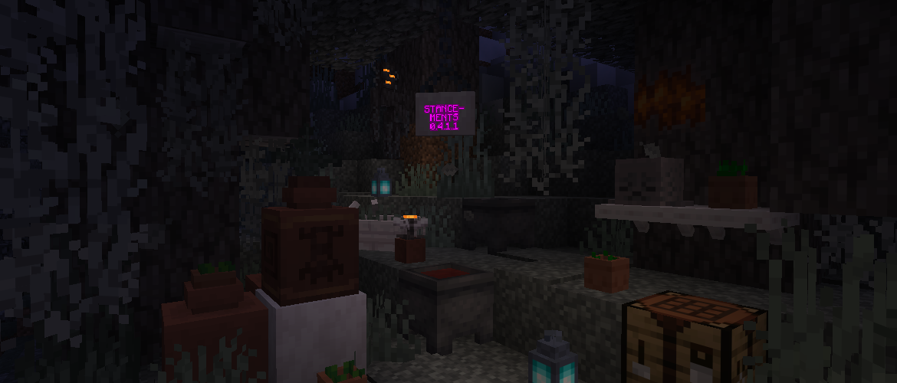

<h1 style="text-align: center;">- Stancements 0.4.1.1 -</h1>

> **Written On:** 22-04-26 - **Last Updated:** 22-04-26

**0.4.1.1** is a minor version of *Stancements* released on April 20, 2026.[^1] It makes features from newer versions of *Minecraft* compatible with this mod.

## Additions
### Blocks
- Added pale oak shelves, crafted from pale oak planks and sticks.

### Miscellaneous
- Songs from the "Chase the Skies" update are now included in *Stancements*' assets by default.
  - These songs are: "Lilypad", "Below and Above", "O's Piano", "Broken Clocks" and "Fireflies".
  - However, I forgot to include them in the "Miner's Music Group" advancement.
- The "Tears" and "Lava Chicken" music discs now have recorded disc styles included in the mod's assets by default.

## Technical
### Changes
- Crafting table cloths no longer render using forced translucency.
- The **Gilded Rail Maximum Speed** option's default value is now a double instead of a float.
  - This was causing the value to appear as floating-point nonsense on the options screen.

## Tags
### Changes
- Added pale oak shelves to the `#stancements:shelves` block and item tags.

### References
[^1]:  ["0.4.1.1: Features from Newer Versions"](https://github.com/isabellawoods/Stancements/commit/60974f860c852ed5bea943e31fa03a46dae8dd40) (Commit `60974f8`) – GitHub, April 20, 2026.