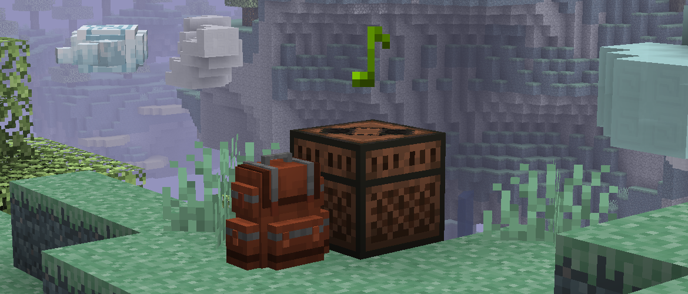

<h1 style="text-align: center;">- Stancements 0.4.2 -</h1>

> **Written On:** 21-05-26 - **Last Updated:** 31-05-26

**0.4.2** is a minor version of *Stancements* released on May 19, 2026.[^1] It adds compatibility with more modded songs, and allows copying songs playing on backpacks from [*Sophisticated Backpacks*](https://modrinth.com/mod/sophisticated-backpacks).

## Additions
### Blocks
- Music disc copying now works with any container from [*Sophisticated Backpacks*](https://modrinth.com/mod/sophisticated-backpacks) and [*Sophisticated Storage*](https://modrinth.com/mod/sophisticated-storage).
  - These blocks must have a Jukebox upgrade applied.
  - The added 20 ticks of padding on jukeboxes isn't present for these containers.
  - All blocks that work with the recorder use the *BlockBasedMusicPlayer* interface on their block entity class.
- Added pale oak shelves, crafted from pale oak planks and sticks.
  - These are only available when *Vanilla Backport* is loaded.
  - Hidden from the creative menu and crafting when the mod isn't loaded.

### Miscellaneous
- Added the `Streaming Services` advancement: Copy any music disc using the Music Recorder.
  - As a side effect, "C418 - Alpha" is not counted towards this advancement as the code that gives the disc to the player triggers this advancement.
  - This isn't an issue in-game as the disc should only ever exist as a copy.

### Recorder Modded Songs Pack
- Added jukebox song definitions for *Create: Aeronautics*, and for the Chaos Cubed songs from *Vanilla Backport*.
- Added defined styles for these modded music discs:

| Mod                           | Music Disc                                                            |
| ----------------------------- | --------------------------------------------------------------------- |
| *Apotheosis*                  | RENREN - Flash                                                        |
| *Apotheosis*                  | Canrer Crebes - Glimmer                                               |
| *Apotheosis*                  | Chamberlain Kaifry - Shimmer                                          |
| *Apothic Enchanting*          | Firel - Eterna, Quanta, Arcana                                        |
| *Brazilian Delight*           | Nação Sururu - Aria Math (Forró Version)                              |
| *Create: Aeronautics*         | Starlotte - Cloud Skipper                                             |
| *Iron's Spells n' Spellbooks* | Caner Crebes - King's Lullaby, Whispers of Ice, The Flame Still Burns |
| *Oh The Biomes We've Gone*    | AOCAWOL - Better Days, Pixie Club                                     |
| *Supplementaries*             | Hlzfss - Heave Ho!, Pancake Music                                     |
| *Vanilla Backport*            | fingerspit - Bounce                                                   |

## Changes
### Blocks
- The recording text from music recorders is now displayed up to 16 blocks away, up from 4.
- Setting the "Master Volume" or "Music" slider to 0% will now stop any recordings.
  - Currently, even jukebox recordings will be stopped. This will be fixed later.

### Miscellaneous
- The `Miner's Music Group` advancement is now classified as a challenge.
  - It now gives **200 experience points**, from the previous 150.
  - The icon disc's label is now purple to match the color of challenge advancements.
- Songs with no equivalent jukebox song will now be properly displayed on *Jade* and on the recorded disc's tooltip.
  - It is displayed as *Sound ID: "namespace:path/to/file.ogg"*.
- The volume of recorded songs is now the same as in vanilla/its source mod.

### Recorder Modded Songs Pack
- All songs from *The Aether* mod now play when the resource pack is loaded.
- "Emile van Krieken - Moa's Song" (`aether4`) now shows the correct name when recording and on the item's tooltip.
- "Amos Roddy - Lilypad" (from *Vanilla Backport*) now plays in-game when the resource pack is applied.
- Disc styles from this pack now work.
  - The  **neoforge:conditions** field couldn't be applied to a single data map entry, so I replaced it with a registry.

## Technical
### Additions
- Added the [`recorded_disc_style`](/Stancements/Docs/Recorded%20Disc%20Style.md) registry.
  - Has the same fields as the data map of the same name, with the inclusion of the  **rarity** field for the "C418 - Alpha" song.
  - All jukebox songs defined in the data map now have an equivalent entry in this registry.
  - Located under `data/<namespace>/stancements/recorded_disc_style/`.
- Added the  **excluded** field to the `stancements:record_song` advancement trigger.
  - **Format**: list of resource locations/identifiers pointing to sound files (includes the "sounds/" prefix and ".ogg" suffix).
  - Excludes songs from being triggered by this condition. For example, adding only this to the object:
```json
{
  "type": "stancements:record_song",
  "conditions": {
    "excluded": [
      "minecraft:sounds/music/game/watcher.ogg"
    ]
  }
}
```
- 
  - will make all songs count towards this advancement **except "Aaron Cherof - Watcher"**. This is used by the `Streaming Services` advancement to exclude "C418 - Alpha".
- Added the old translation keys for ambient music to `deprecated.json`.

### Changes
- Jukebox songs for ambient songs on the "music_disc/" or "records/" folders will now be closer to the actual song location.
  - For example, `minecraft:sounds/records/blocks.ogg` would fail to find its jukebox song, as it is formatted as `minecraft:blocks` and not `minecraft:records/blocks`. This fix should make this work.
  - The "Recording \<song>" tooltip still shows the wrongly formatted name (will be fixed later).
- The **Gilded Rail Maximum Speed** option's default value is now a double instead of a float.
  - This was causing the value to appear as floating-point nonsense on the options screen.
- The `stancements:minecart_tags` attachment now uses the *DyeColor* codec for saving and loading.
- Renamed the following methods:

| Class                | Old Name                          | New Name                         |
| -------------------- | --------------------------------- | -------------------------------- |
| *CropPotBlock*       | `getBonemealAgeIncrease`          | `getBoneMealAgeIncrease`         |
| *MusicRecorderBlock* | `tryRecordingFromAdjacentJukebox` | `tryRecordingFromAdjacentBlock`  |
| *RecordedDiscItem*   | `setAppearanceFromDataMap`        | `setAppearanceFromStyleRegistry` |
| *Stadvancements*     | `createIconStack`                 | `createRecordAllSongsIcon`       |

### Removals
- Removed the [`recorded_song_styles`](/Stancements/Docs/Recorded%20Song%20Styles.md) data map.
  - This was because the *NeoForge* conditions field doesn't work inside a value field, which was required for the "Recorder Modded Songs" data pack.
  - Replaced by the `recorded_disc_style` registry.

## Tags
### Changes
- Added pale oak shelves to the `#stancements:shelves` block and item tags.

### References
[^1]: ["0.4.2: Sop. Backpacks Compat & Working Disc Styles"](https://github.com/isabellawoods/Stancements/commit/56ca857edc16b5f7e3d04b3d5ac0a4528660057c) (Commit `56ca857`) — GitHub, May 19, 2026.