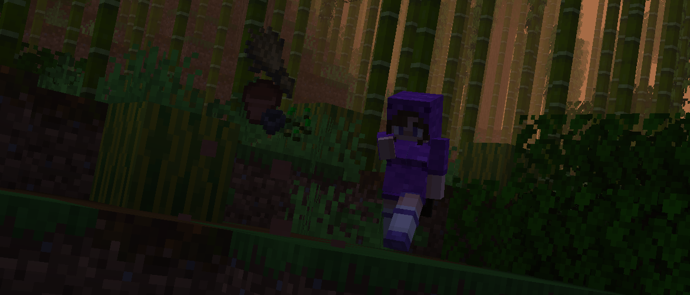

<h1 style="text-align: center;">- Stancements 0.4.3 -</h1>

> **Written On:** 08-07-26 - **Last Updated:** 19-08-26 - **Download**: [`1.21.1`](https://github.com/isabellawoods/Stancements/releases/download/0.4.3/stancements-neoforge-0.4.3+1.21.1.jar) | [`26.1.2`](https://github.com/isabellawoods/Stancements/releases/download/0.4.3/stancements-neoforge-0.4.3+26.1.2.jar)

**0.4.3** is a minor version of *Stancements* released on June 19, 2026.[^1] It allows ambient recorded discs to stop the game's music for it to play, and fixes various small bugs.

## Additions
### Blocks
- Music discs can now stop themselves from being copied by the music recorder.
  - This is done using the `#copying_prohibited` jukebox song tag.
  - When blocked, this message is shown to the recordee: *"This music disc cannot be copied by design"*.

### Items
- Added recorded disc label `14.0`, for the new "fingerspit - Bounce" music disc.
  - The recorded disc style for "Bounce" hasn't been updated yet.
- If a recorded disc has the `music_data.id` component and no `jukebox_playable`, the game will automatically try to re-record that disc.
  - When first recording, both component are now saved to the item.
  - The old `music_id` component is now converted into `music_data.id`.

### Miscellaneous
- Added a new client-side option:
  - **Music Discs Block Ambient Music** (`block.musicDiscsBlockAmbientMusic`): Whether music discs in the `#cancels_ambient_music` tag can block ambient music from playing. Defaults to `true`.
    - Currently, only vanilla jukeboxes and the Jukebox Upgrade from *Sophisticated Backpacks/Storage* work with this option.
- Added a new option:
  - **Default Recording Duration** (`block.defaultRecordingDuration`): Controls how long an ambient song recording takes. Defaults to `600` ticks, or 30 seconds.
    - This also controls the comparator output of the recorder, since that doesn't follow the recorder's actual recording duration.
- The mod's display URL now points to its [Modrinth page](https://modrinth.com/mod/stancements), with its GitHub page only being shown when *Forged Mod Menu* is loaded, appearing as "Sources".

### [Recorder Modded Songs](/Melony%20Studios%20Wiki/Resource%20Packs/Recorder%20Modded%20Songs.md) Pack
- Added Brazilian Portuguese translations for the Chaos Cubed songs.
- Added jukebox song definitions for:
  - **\[1.21]** *Biomes O' Plenty*, *Paradise Lost*
- Added defined styles for these modded music discs:

| Mod                 | Music Disc               |
| ------------------- | ------------------------ |
| *Biomes O' Plenty*  | Tim Rurkowski - Wanderer |
| *Dimensional Doors* | Stevenrs11 - Creepy      |
| *Dimensional Doors* | Firel - They Stare Back  |
| *Dimensional Doors* | Lachney - White Void     |

## Changes
### Blocks
- Fully grown crop pots now drop the contents of a fully grown crop, instead of only one seed.
- Crop pots no longer need a pickaxe to drop, and are broken slightly faster now.
- Non-hopping crop pots now stack correctly.
- Shelves now properly block light when they're, for example, used as a roof.
- Setting the "Music" sound slider to 0% no longer blocks copying music discs with the recorder.

### Items
- The "Sound ID" tooltip will no longer show up on recorded discs if they have the `jukebox_playable` component.

### Miscellaneous
- *Stancements*' creative tab now renders the mod's logo instead of the regular title.
  - Instead of a hardcoded texture, it dynamically adapts the text and background length based on the translation key.
- Updated the mod's logo when viewed from *Forged Mod Menu*.
- **\[1.21]** When recording songs outside of the `sounds/music/` folder, the "Recording \<song>" text should now be properly translated.

### [Recorder Modded Songs](/Melony%20Studios%20Wiki/Resource%20Packs/Recorder%20Modded%20Songs.md) Pack
- "Welcome to Paradise" (`aether1`) by Emile van Krieken has been pitched down slightly to match the album version.
- "Crag Gardens" by AOCAWOL (from *Oh The Biomes We've Gone*) is now recorded properly (ID was `craig_gardens` before).
- "The Flame Still Burns" by Caner Crebes (from *Iron's Spells n' Spellbooks*) now uses the label `7.0`, from `10.0`.

## Removals
### Blocks
- Music discs playing in containers from *Sophisticated Storage* can no longer be copied.
  - This is an oversight from relocating this mod's mixin classes, where *STStorageBlockEntityMixin* was removed from the mixins file.

## Technical
### Additions
- Added a client extension for recorded discs, just to define their default color.
- *StartRecordingAttemptEvent* can now set the music ID being recorded.

### Changes
- Renamed the fields of the `stancements:record_song` advancement trigger.
  -  **music_id** to **id**;
  -  **copying_song** to **copying**.
- `hoppingCropPot(int)` in *STItems* can now define whether the crop pot has a hopper.
  - Its signature has been changed to `cropPot(int, boolean)`.
- Renamed the Melony Studios command to `mstudios`, and removed the namespace from all subcommands.
- The `gameplay/update_recorded_disc` subcommand now properly updates Chaos Cubed music from *The Mato*'s music pack.
- **\[1.21]** Updated *Forged Mod Menu* to `11.2.0`, from `11.1.0`.
- All mixin classes are now organized into folders based on what they do:
  - `logo`: The mixin that handles rendering the mod's logo on its creative tab;
  - `recorder`: Any mixins relating to recording music, not just the recorder block;
  - `songblock`: Mixins that handle blocking ambient music from playing when an ambient recorded disc is playing;
  - `tagging`: Mixins about (un)tagging minecarts.
  - Mixins without a specific folder are kept in the top-level `mixin` folder.

## Tags
### Additions
- Added translations for all album jukebox song tags.
- Added the `#stancements:ambient_music` jukebox song tag.
  - Collection tag for all music that can play from the player's *MusicManager*.
- Added the `#stancements:cancels_ambient_music` jukebox song tag.
  - Contains `#stancements:ambient_music`.
  - Songs in this tag stop the ambient music in *MusicManager* so the disc can play uninterrupted.
- Added the `#stancements:copying_prohibited` jukebox song tag.
  - Songs in this tag cannot be copied using the recorder.
- Added jukebox song tags for all main albums in *Minecraft*.
  - Previously, these tags were included in *STJukeboxSongTags*, but did not have files corresponding to them.
  - **List of all album tags:**
    - `#minecraft:album/volume_alpha`;
    - `#minecraft:album/volume_beta`;
    - `#minecraft:update_aquatic`;
    - `#minecraft:album/nether_update`;
    - `#minecraft:album/caves_and_cliffs`;
    - `#minecraft:album/the_wild_update`;
    - `#minecraft:album/trails_and_tales`;
    - `#minecraft:album/tricky_trials`.
    - The tags `#minecraft:album/chase_the_skies` and `#minecraft:album/chaos_cubed` are included in the **Recorder Modded Songs** data pack.

### References
[^1]: ["0.4.3: Bugfixes & Recording Updates"](https://github.com/isabellawoods/Stancements/commit/b2ff6ad3879d8147d360e1aca352367cfec65c4b) (Commit `b2ff6ad`) — GitHub, June 19, 2026.