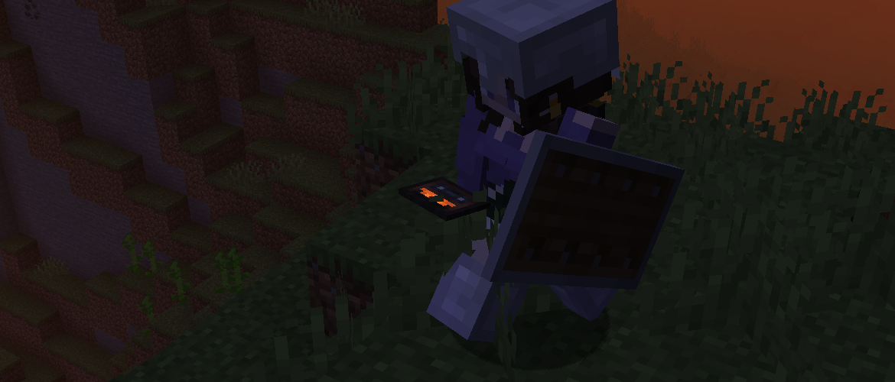

<h1 style="text-align: center;">- Stancements 5.0.0 Beta 1 -</h1>

> **Written On:** 25-07-26 - **Last Updated:** 19-08-26 - **Download**: [`1.21.1`](https://github.com/isabellawoods/Stancements/releases/download/5.0.0-beta.1/stancements-neoforge-5.0.0-beta.1+1.21.1.jar)

**5.0.0 Beta 1** (stylized as **5.0.0-beta.1** in the `.jar` file) is a major update of *Stancements* released on July 23, 2026.[^1] It adds the pocket recorder, short and long cassette tapes, and moves all ambient jukebox songs to the `minecraft` namespace to match the 26.1 version.

> [!WARNING] Known issues
> - **\[Fixed in `5.0.0-beta.2`]** The `#stancements:ambient_music` jukebox song tag and several other album tags haven't had their IDs changed to match the new names.
>   - This means that recorded ambient songs won't block existing ambient songs from playing in this version.

## Additions
### Items
- Added the pocket recorder.
  - Records ambient as soon as they start playing, and save them to the inserted cassette tape.
  - Cassettes can be inserted by right-clicking them with the pocket recorder in the inventory, similar to the bundle.
  - Can be toggled by right-clicking it in the world.
  - Its state is indicated by the glowing part of its texture: Orange is "Paused", blue is "Idle" and green is "Recording".
- Added short and long cassette tapes.
  - Crafted with 3 copper ingots, 1 iron/gold ingot and 2 redstone dust. The recipe gives two tapes.
  - Can be inserted into pocket recorders to record songs.
  - Short tapes can store up to 15 songs, and long tapes up to 30.
  - Stack up to 8.
- Sculk-infested vinyl discs now have a **15% chance to eject itself after 20 seconds** when attempting to record anything.

### Miscellaneous
- Added the `Like the Old Times` advancement: *"Record any song using a Pocket Recorder"*.
- Added a new client-side option:
  - **Screen Music Blacklist** (`item.screenMusicBlacklist`): A list of *Screen*s that, when open, cannot send a *SendClientTrack* packet to the server. This packet is how the pocket recorder sources its music.
    - By default, it includes the Credits screen so the pocket recorder doesn't record "C418 - Alpha".
- Errors that happen when networking recording information will now be logged.
- Added **4** new sound events:
  - `item.inventory_recorder.toggle` ("Pocket Recorder button clicks");
  - `item.inventory_recorder.full` ("Pocket Recorder refuses to record");
  - `item.inventory_recorder.insert_storage` ("Cassette Tape slots in");
  - `item.inventory_recorder.remove_storage` ("Cassette Tape pops out").

## Changes
### Items
- The sculk on sculk-infested music discs now glows in the dark.
- Updated the recorded disc conversion message:
  - Instead of asking to use a command to convert it, it will simply ask the player to hold the disc in their inventory.
  - The message is now in orange, as the conversion doesn't require much player input.
- When **Add Items to Vanilla Tabs** is enabled, shattered discs now come after disc fragments in the "Ingredients" tab.
- Vanilla music discs now have the proper disc styles when copied.
- The shattering sound played when trying to copy music disc "11" now plays at a lower volume.
- The cave sounds played when trying to copy music disc "13" are no longer pitched down and are now played at a lower volume.

### Blocks
- If a music recorder has multiple music players around it, it will now skip the ones with copied music discs or music discs that disallow copies until it finds a valid music player.
- The  **ticks_until_ejection** field in music recorders is now cleared if the **Recorder Free Will** option is turned off.
- Recording a song with no equivalent jukebox song will now display the correct name in *Jade*.
- The "cannot copy" and "copying prohibited" error messages no longer have a period at the end.

### Miscellaneous
- The `Miner's Music Group` advancement now grants 500 experience, from the previous 200.
  - Updated this advancement's description to mention it now works with pocket recorders as well.
- The mod's logos, banner and *Catalogue* background texture have been compressed.
- Fixed a single misplaced pixel in the "[Recorder Modded Songs](/Melony%20Studios%20Wiki/Resource%20Packs/Recorder%20Modded%20Songs.md)" resource- and data packs.
- The "Tags: \<minecart tags>" display in *Jade* is no longer always pluralized: "Tag(s): \<tags>".
- **\[Bra. Portuguese]** Fixed a typo in the sculk-infested vinyl disc tooltip: "tentava gravava" -> "tentava gravar".

## Technical
### Additions
- Added the `stancements:pipeline/sculk_ejection_chance` vinyl modifier.

### Changes
- Jukebox song definitions for vanilla songs are now located in the `minecraft` namespace, rather than in `stancements`.
  - Unfortunately, there's no fixer for discs created before [0.4.3](Changelog%200.4.3.md), so they will end up blank.
  - For discs created in **0.4.3** and later, simply having them in your inventory will automatically convert them to the new format (they must have the `music_data.id` component).
  - This change affects both the location of the jukebox songs, and of the sound events.
- Changed the `stancements:game/end/alpha` recorded disc style's namespace to `minecraft`.
- The *Stancements* logo background texture used in this mod's creative tab is now 16×16, from 9×9.
- The field `EjectAfterTicksModifier.DEFAULT_TICKS_UNTIL_EJECTION` has been moved to *MusicRecorderBlockEntity*.
- Updated *Reutilities* to `1.5.2`, from `1.5.0`.
- Renamed the following methods and fields:

| Class         | Old Name                  | New Name                    |
| ------------- | ------------------------- | --------------------------- |
| STSounds      | `SOUNDS`                  | `STANCEMENTS`               |
| STEvents      | `addDataPackRegistries()` | `addDataDrivenRegistries()` |
| VinylModifier | `appliesForCopies()`      | `actsOnCopies()`            |

#### `record_song` advancement trigger
-  The  **excluded** field is now a list of [tracks](/Stancements/Docs/Track.md).
- The  **id** field has been renamed to  **track**, and is now defined as a *Track*.
- Added the  **source** field, which defines the source this track is expected to come from. Can be one of `music_recorder`, `music_remixer` or `pocket_recorder`.

#### [Vinyl modifiers](/Stancements/Docs/Vinyl%20Modifier.md)
- The  **targets** field in vinyl modifiers now uses [tracks](/Stancements/Docs/Track.md).
  - As **targets** is no longer a list of jukebox songs, targetting non-existent songs is now possible without making the modifier run for any recorded song.
  - All modifiers that use this field mark the track as resolved.
  - Since modifiers now use tracks, which in theory are never `null`, the
- Renamed the  **modifies_when_copying** field to **modifies_copies**.
  - The debug log for this has also been changed to match this rename.
- The  **ejection_chance** field of the `eject_after_ticks` component is now a *float provider*.
- Updated the wording slightly of the `run_function` component error message.

### Removals
- Removed `RecordedDiscItem.sanitizeMusicIDLocation()`, as *Minecraft* songs now use the `minecraft` namespace.

## Tags
### Additions
- Added the `#stancements:cassette_tapes` item tag.
  - Contains short and long cassette tapes.
  - Items in this tag, when stored inside a pocket recorder, will display a small cassette in its casing.

### Changes
- Added `stancements:pipeline/sculk_ejection_chance` to the `#stancements:priority_modification` vinyl modifier tag.

### References
[^1]: ["5.0.0-beta.1: Pocket Recorder & Songs in `minecraft` Namespace"](https://github.com/isabellawoods/Stancements/commit/83896362c87ddf4019f788b7ac59240065a4b95f) (Commit `8389636`) — GitHub, July 23, 2026.