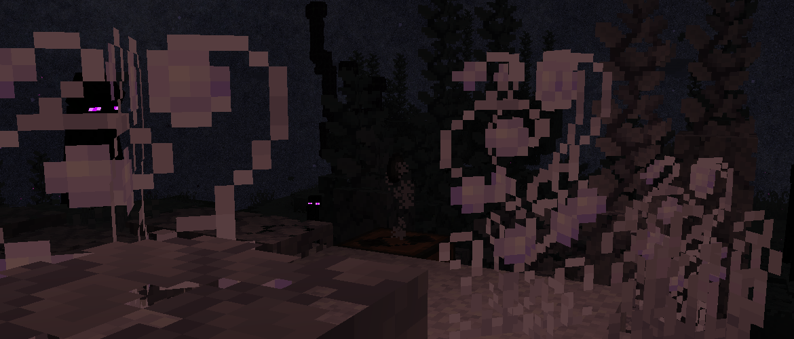

<h1 style="text-align: center;">- Stancements 5.0.0 Beta 2 -</h1>

> **Written On:** 29-08-26 - **Last Updated:** 30-08-26 - **Download**: [`1.21.1`](https://github.com/isabellawoods/Stancements/releases/download/5.0.0-beta.2/stancements-neoforge-5.0.0-beta.2+1.21.1.jar)

**5.0.0 Beta 2** (stylized as **5.0.0-beta.2** in the `.jar` file) is a minor update of *Stancements* released on August 28, 2026.[^1] It adds album definitions to data packs, and makes several technical updates behind the scenes.

## Additions
### Blocks
- Added the album block.
  - Currently, it has no texture, no model, no item form (thus no drops), and no recipe.
  - When right-clicked, it opens a crude interface with only the title "Album" being shown.
  - Use the sound of bamboo wood, and can be broken by hand relatively fast.

### Miscellaneous
- Added a new common option:
  - **Recorded Disc Auto-Conversion** (`item.recordedDiscAutoConversion`): Whether recorded discs without a valid jukebox song, but with a defined `music_data.id`, should try to re-record themselves when in the player's inventory. Defaults to `true`.

### [Recorder Modded Songs](/Melony%20Studios%20Wiki/Resource%20Packs/Recorder%20Modded%20Songs.md) pack
- Added the `enderscape:music_disc_decay` vinyl modifier, targeting the "lunarbunten — decay" music disc.
  - When trying to record the disc, this message is shown: "*Something is interfering with the recorder...*", using the color **\#AAB9A6**.
  - It currently doesn't play any sounds.

## Changes
### Blocks
- The shelf recipe now gives 6 shelves instead of 3.

### Items
- If the pocket recorder's timer goes into the negatives, the description will now be colored red.
- Renamed the `recording_turns_into` component to `recordable_transform`.
  - Added two new fields:  **on_remix** and  **on_write**. Both point to item IDs to use when converted by the upcoming **music remixer** and **cassette tape manager** (temporary name).
  - The  **when_recorded** field has been renamed to **on_record**.
- The `label`, `state` and `storage_inserted` (all under *Stancements*' namespace) model properties are now available for all items.

### Miscellaneous
- My friend "**Reitrix**" is now credited in this mod for his contributions on ideas and play-testing.

## Technical
### Additions
- Added the `album` block entity. It has no extra fields.
- Added [albums](/Stancements/Docs/Album.md) to data packs.
  - Currently, they aren't used anywhere in game. They will eventually be used by **album blocks** to display album and song information in-game.
  - Albums define a **track list** for which songs are stored within. They also provide information about songwriters, genres, and sources for the name and description.
  - If the [`logging` debugging flag](/Melony%20Studios%20Wiki/Debugging%20Flags.md#List%20of%20flags) is enabled, the track list of every album is printed to the logs.
  - There are **7** albums registered by default. Albums for songs in the [Recorder Modded Songs](/Melony%20Studios%20Wiki/Resource%20Packs/Recorder%20Modded%20Songs.md) data pack will be added at a later date.
    - `minecraft:volume_alpha`;
    - `minecraft:volume_beta`;
    - `minecraft:nether_update`;
    - `minecraft:caves_and_cliffs`;
    - `minecraft:the_wild_update`;
    - `minecraft:trails_and_tales`;
    - `minecraft:tricky_trials`.

#### [Vinyl modifiers](/Stancements/Docs/Vinyl%20Modifier.md)
- Added the `eject` modification strategy, which runs when the recordable disc has been ejected out of the music recorder.
- Added the  **keep_components** fields to the `replace_recordable_disc` modifier component, which controls whether components from the old item should be moved over to the replacement item.
- The  **radius** and  **height** fields on the `replace_disk` modifier component are now  floats.
- Slightly updated the `run_modifier` modifier component's error message again.

### Changes
- Updated some of the tags used by the `music_recorder` block entity:
  -  **copying_song** has been renamed to **copying**.
  - The old  **music_id** tag, based on a *ResourceLocation*, has been replaced by a  **track** tag.
    - Part of the functionality from **copying_song** has been moved to this [track](/Stancements/Docs/Track.md)-based tag.
- The `apply_recording_turns_into` loot function has been renamed to `transform_recordable`.
  - Added the  **transform** field (`on_record`, `on_remix` or `on_write`): defines which transform should be applied to the recordable disc.
- The  **color** and  **label** fields on [recorded disc styles](/Stancements/Docs/Recorded%20Disc%20Style.md) are now both optional.
  - If one of the fields is absent, it will be randomized like usual.
  - Both fields cannot be absent simultaneously, though.
- All jukebox song and vinyl modifier tags are now data-generated.
- Updated the *ModDevGradle* plugin to `2.0.143`, from `2.0.80`.
- Renamed the following methods, fields and classes:

| Class                             | Old name                     | New name                    |
| --------------------------------- | ---------------------------- | --------------------------- |
| ApplyRecordingTurnsInto           | *N/A*                        | TransformRecordableFunction |
| ApplyRecordingTurnsInto           | `apply()`                    | `withTransform()`           |
| BlockBasedMusicPlayer             | `findJukeboxSongFromDisc()`  | `sourceSongFromItem()`      |
| ModificationContext               | `copyingSong()`              | `copying()`                 |
| MusicData                         | `markCopied()`               | `markAsCopy()`              |
| MusicData                         | `withID()`                   | `withTrack()`               |
| MusicRecorderBlockEntity          | `copyingSong()`              | `copying()`                 |
| MusicRecorderBlockEntity          | `musicID()`                  | `track()`                   |
| MusicRecorderProvider             | `copyingSong()`              | `copying()`                 |
| MusicRecorderProvider             | `musicID()`                  | `track()`                   |
| PotPlantables                     | *N/A*                        | PotPlantable                |
| RecordingTurnsInto                | *N/A*                        | RecordableTransform         |
| RecordSongTrigger.TriggerInstance | `copyingSong()`              | `copying()`                 |
| StartRecordingAttempt             | `clientMusicID()`            | `clientTrack()`             |
| StartRecordingAttemptEvent        | `clientMusicID()`            | `clientTrack()`             |
| StartRecordingAttemptEvent        | `withClientMusic()`          | `withClientTrack()`         |
| STDataComponents                  | `RECORDING_TURNS_INTO`       | `RECORDABLE_TRANSFORM`      |
| STLootFunctions                   | `APPLY_RECORDING_TURNS_INTO` | `TRANSFORM_RECORDABLE`      |

### Removals
- Removed the [`pot_plantables`](/Stancements/Docs/Pot%20Plantables.md) item data map.
  - Data maps are usually made for something to be fully data-driven, but these required a new block for each pot variant.
  - Plus, I am aiming for a multi-loader port in the future, and Fabric doesn't have an equivalent of data maps (as far as I'm aware).
- **\[1.21.1]** Removed the `refmap` line from this mod's mixins file, as it was never generated in the first place.
- Removed the following methods and classes:

| Class                 | Method/field              |
| --------------------- | ------------------------- |
| BlockBasedMusicPlayer | `findJukeboxSongFromID()` |
| ModificationStrategy  | `id()`                    |
| STDataMaps            | *N/A*                     |
| STEvents              | `registerDataMaps()`      |

## Tags
### Additions
- Added the `#stancements:not_required_for_completion` jukebox song tag.
  - Contains "Biome Fest", "Blind Spots", "Haunt Muskie", "Aria Math", "Dreiton" and "Taswell", all by C418.
  - Jukebox songs in this tag are not required to complete a collection within an album block due to not being able to be recorded during survival gameplay.

### Changes
- The `#stancements:ambient_music` jukebox song tag and all other album tags are point to the correct song IDs.

### [Recorder Modded Songs](/Melony%20Studios%20Wiki/Resource%20Packs/Recorder%20Modded%20Songs.md) pack: Changes
- "Menoch — Sycamore Heights" (from *TerraFirmaCraft*) and "Moserao — Rivers of Honey" (from *The Bumblezone*) now use their correct IDs in the `#stancements:ambient_music` jukebox song tag.

### References
[^1]: ["5.0.0-beta.2: Album Definitions & Technical Updates"](https://github.com/isabellawoods/Stancements/commit/d5c36280c92ec5ff02a9bcf5a5d998264f3c7145) (Commit `d5c3628`) — GitHub, August 28, 2026.