# Recorded Disc Style
> [!NOTE]
> **Last Updated**: 30-08-26 (5.0.0-beta.2 - 1.21.1 | 0.4.4 - 26.1.2)

**Recorded disc styles** define a color, a label, and optionally an item rarity for when a song is recorded/copied. If not defined, the item will have a randomized color and label.

Recorded disc styles can be defined using JSON files in a data pack at the path `data/<namespace>/stancements/recorded_disc_style/`, and can have tags defined at the path `data/<namespace>/tags/stancements/recorded_disc_style/`.

## JSON format
Recorded disc styles are defined using the following format:

-  The root object.
  -  **color**: *(optional, defaults to `-1`)* An integer (decimal or hexadecimal) of the color applied to the item. Must be a value between **-1** and **16777215** (`#ffffff`).
    - In **26.1.2** this field can also be defined as a list of 3  floats, ranging from `0.0` to `1.0`.
    - In **26.1.2**, when using a hexadecimal string, there must now be 6 digits.
  -  **label**: *(optional, defaults to `0`)* A float defining the label applied to the item. Must be between **0** and **14**.
  -  **rarity**: *(optional, defaults to `uncommon`)* The rarity for the recorded disc item. Can be one of: `common`, `uncommon`, `rare`, `epic`.

If  **color** and  **label** are both left undefined, an error will be shown as at least one of these fields must be present.

### Example
```json
{
  "color": "#ffdd99",
  "label": 10.0,
  "rarity": "rare"
}
```

## Label appearances
| `1` - "blocks / stal / strad"<br> |     `2` - "cat / mall"<br>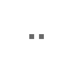      |     `3` - "chirp"<br>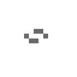     |    `4` - "far"<br>     |
| :--------------------------------------------------------------------------: | :------------------------------------------------------------------------: | :------------------------------------------------------------------: | :---------------------------------------------------------------: |
|      **`5` - "mellohi"**<br>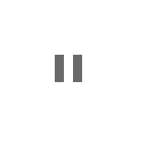      | **`6` - "Pigstep / Relic"**<br>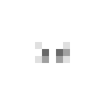 | **`7` - "Precipice"**<br> | **`8` - "Tears"**<br>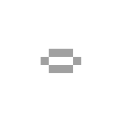  |
|     **`9` - "13 / ward"**<br>     |    **`10` - "Creator"**<br>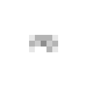    |    **`11` - "5"**<br>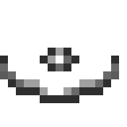    | **`12` - "wait"**<br>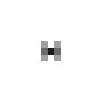 |
|                                                                              | **`13` - "Lava Chicken"**<br>  | **`14` - "Bounce"**<br>  |                                                                   |

## Usage in *Stancements*
By default, *Stancements* adds recorded disc styles for all vanilla music discs. For modded music discs, the [Recorder Modded Songs](/Melony%20Studios%20Wiki/Resource%20Packs/Recorder%20Modded%20Songs.md) data packs provides styles for many mods in use within my personal modpacks.

| Name                                  | Color        | Label |                   In-game appearance[^1]                    |
| ------------------------------------- | :----------- | :---- | :---------------------------------------------------------: |
| "C418 — 13"                           | **\#FFD800** | `9`   |    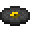     |
| "C418 — cat"                          | **\#4CFF00** | `2`   |    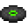    |
| "C418 — blocks"                       | **\#E2543B** | `1`   |     |
| "C418 — chirp"                        | **\#FF0004** | `3`   |   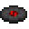   |
| "C418 — far"                          | **\#B6FF00** | `4`   |        |
| "C418 — mall"                         | **\#9A75FF** | `2`   |   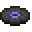    |
| "C418 — mellohi"                      | **\#B200FF** | `5`   |  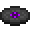  |
| "C418 — stal"                         | **\#000000** | `1`   |   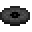    |
| "C418 — strad"                        | **\#FFFFFF** | `1`   |      |
| "C418 — ward"                         | **\#8EC600** | `9`   |   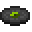    |
| "C418 — 11"                           | **\#141414** | `8`   |    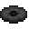     |
| "C418 — wait"                         | **\#81A9E2** | `12`  |       |
| "Lena Raine — otherside"              | **\#1E8B8C** | `2`   | 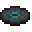 |
| "Lena Raine — Pigstep"                | **\#FDF55F** | `6`   |  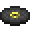  |
| "Samuel Åberg — 5"                    | **\#29DFEB** | `11`  |     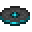     |
| "Aaron Cherof — Relic"                | **\#88E6FF** | `6`   |   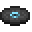   |
| "Aaron Cherof — Precipice"            | **\#7AB799** | `7`   | 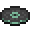 |
| "Lena Raine — Creator"                | **\#FFDD99** | `10`  |  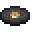  |
| "Lena Raine — Creator (Music Box)"    | **\#FFDD99** | `10`  |    |
| "C418 — Alpha" (with **Epic** rarity) | **\#9AC9BF** | `13`  |   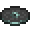   |

## History
| Version                                                             | Chages                                                                                                                                                                                                                                                                                                                                                                                                                                                                                                                                                                               |
| ------------------------------------------------------------------- | ------------------------------------------------------------------------------------------------------------------------------------------------------------------------------------------------------------------------------------------------------------------------------------------------------------------------------------------------------------------------------------------------------------------------------------------------------------------------------------------------------------------------------------------------------------------------------------ |
| [0.4.2](/Stancements/Changelogs/Changelog%200.4.2.md)               | Added recorded disc styles, which supercede the [`recorded_song_styles`](/Stancements/Docs/Recorded%20Song%20Styles.md) data map.                                                                                                                                                                                                                                                                                                                                                                                                                                                    |
| [0.4.3](Stancements/Changelogs/Changelog%200.4.3.md)                | With the addition of a label for "fingerspit - Bounce", the upper bounds of the **color** field is now `14.0`.                                                                                                                                                                                                                                                                                                                                                                                                                                                                       |
| [0.4.4](/Stancements/Changelogs/Changelog%200.4.4.md)               | <li>As a consequence to the vinyl modifier rewrite, song under the `minecraft` namespace will now locate disc styles under the `stancements` namespace.</li> <li>"C418 — stal" now has a more fitting disc style: **\#141414** and label `8` (was **\#000000** and label `0` before).</li> <li>**\[26.1.2]** The  **color** field, when used in hex numbers, must now always have 6 digits, and now accepts a list of 3  floats as input.</li> |
| [5.0.0-beta.1](/Stancements/Changelogs/Changelog%205.0.0-beta.1.md) | <li>The `stancements:game/end/alpha` disc style is now under the `minecraft` namespace.</li> <li> Songs under the `minecraft` namespace will now locate disc styles in the correct namespace again.</li>                                                                                                                                                                                                                                                                                                                                                                             |
| [5.0.0-beta.2](/Stancements/Changelogs/Changelog%205.0.0-beta.2.md) | The  **color** and  **label** fields are now both optional. If one is absent, it will be randomized.                                                                                                                                                                                                                                                                                                                                  |

## Issues
Issues relating to "Recorded disc styles" are maintained on [*Stancements*' issue tracker](https://github.com/isabellawoods/Stancements/issues). Issues should be reported and viewed there.

## See also
- [Vinyl modifier tag](/Tags/Stancements/Vinyl%20Modifier%20Tag.md)

## Navigation
### Data pack definitions
|                   |                                                                                                                                                                                                                                                                                                                                                                                                                                                                                                                                                                                                                   |
| ----------------- | ----------------------------------------------------------------------------------------------------------------------------------------------------------------------------------------------------------------------------------------------------------------------------------------------------------------------------------------------------------------------------------------------------------------------------------------------------------------------------------------------------------------------------------------------------------------------------------------------------------------- |
| **Back Math**     |  [Crystallizer Recipes](/Back%20Math/Docs/Crystallizer%20Recipes.md) ▪  [Outfit Definition](/Back%20Math/Docs/Outfit%20Definition.md) ▪  [Queen Lucy Variant](/Back%20Math/Docs/Queen%20Lucy%20Variant.md) ▪  [Queen Lucy Pet Variant](/Back%20Math/Docs/Queen%20Lucy%20Pet%20Variant.md) ▪  [Wanderer Sophie Variant](/Back%20Math/Docs/Wanderer%20Sophie%20Variant.md) |
| **Mellotech**     |  [Cluster Material](/Mellotech/Docs/Cluster%20Material.md)                                                                                                                                                                                                                                                                                                                                                                                                                                                                                                              |
| **Melony Lib**    |  [Banner Pattern](/Melony%20Lib/Docs/Banner%20Pattern.md)                                                                                                                                                                                                                                                                                                                                                                                                                                                                                                                 |
| **Reutilities**   |  [Outfit Definition](/Reutilities/Docs/Outfit%20Definition.md)                                                                                                                                                                                                                                                                                                                                                                                                                                                                                                      |
| **Revaried**      |  [Bowl Type](/Revaried/Docs/Bowl%20Type.md) ▪  [Damage Source](/Revaried/Docs/Damage%20Source.md) ▪  [Wool Armor Color](/Revaried/Docs/Wool%20Armor%20Color.md)                                                                                                                                                                                                                                                                                                                               |
| **Stacked Goods** |  [Mossifiables](/Stacked%20Goods/Docs/Mossifiables.md) ▪  [Mineral Extraction](/Stacked%20Goods/Docs/Mineral%20Extraction.md)  ▪  [Scrapables](/Stacked%20Goods/Docs/Scrapables.md)                                                                                                                                                                                                                                                                                                         |
| **Stancements**   |  [Album](/Stancements/Docs/Album.md) ▪  [Pot Plantables](/Stancements/Docs/Pot%20Plantables.md)  ▪  [Recorded Song Styles](/Stancements/Docs/Recorded%20Song%20Styles.md) ▪  **Recorded Disc Style** ▪  [Track](/Stancements/Docs/Track.md) ▪  [Vinyl Modifier](/Stancements/Docs/Vinyl%20Modifier.md)                                                                   |

### Notes
[^1]: Not entirely accurate as items inside inventories are slightly dimmer compared to the item's actual texture.